# 02.网站域名

## 1.域名查询

域名查询是网络安全信息收集的重要环节之一，通过多种方式可以获取域名背后的注册信息、备案信息、企业背景以及相关邮箱数据。这些信息常用于渗透测试的前期信息收集，也同样对企业的安全防护有参考意义。  

---

### 1.1 备案查询
- **定义**：在国内网站需要通过工信部进行 ICP 备案才能投入使用，备案信息包括域名、主办单位、网站名称等。  
- **常用平台**：工信部备案系统（https://beian.miit.gov.cn）、悠悠域名（https://www.yooym.com/tool/beiancx_aizhanwang.cn.html）、站长之家（https://icp.chinaz.com/）。  
- **可获取信息**：  
  - 主办单位名称（个人/企业/机构）。  
  - 网站负责人姓名。  
  - 备案号（ICP 号）。  
  - 网站开办时间。  
- **安全意义**：  
  - 攻击者可据此判断网站背后主体，进而追踪企业的其他资产。  
  - 企业可利用备案查询核对是否存在“冒名备案”的情况。  

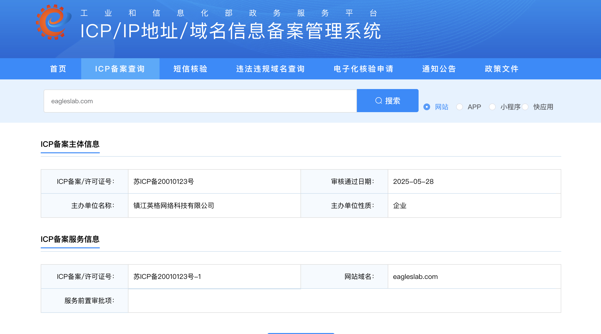

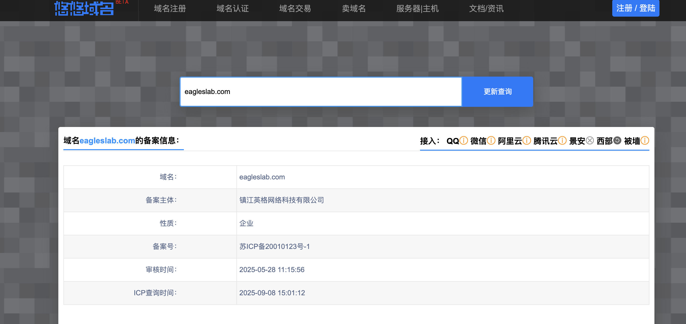

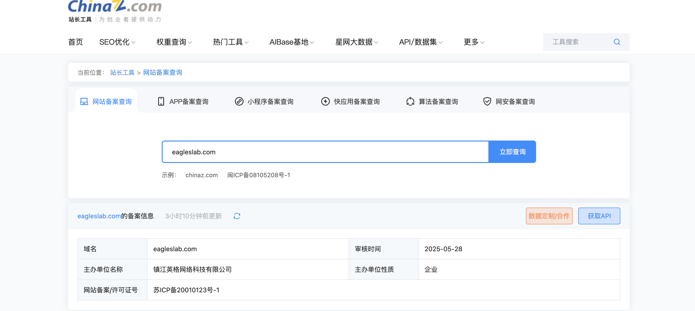

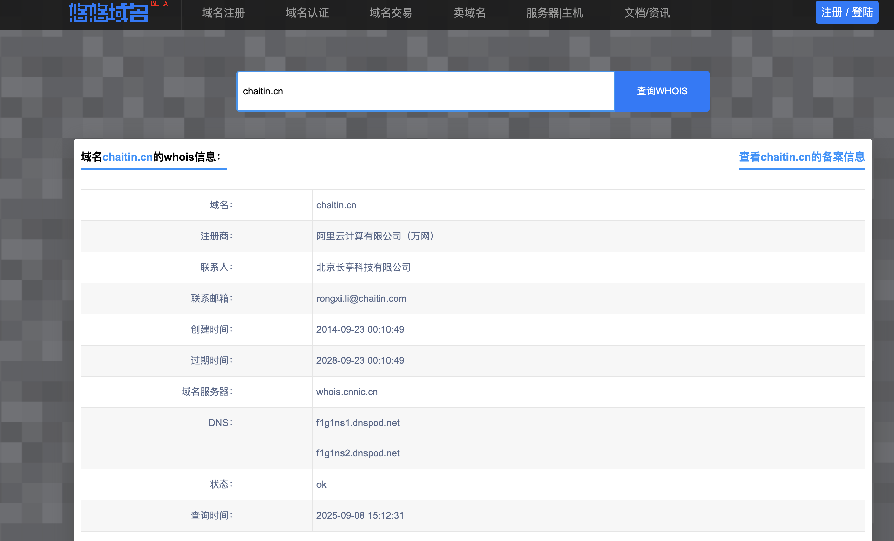

### 1.2 企业关系查询
- **定义**：通过工商数据平台，挖掘域名背后的企业及其股东、关联公司、上下游关系。  
- **常用工具/平台**：企查查、天眼查、风鸟（https://riskbird.com/）。  
- **可获取信息**：  
  - 企业法定代表人、注册资本、联系方式。  
  - 企业对外投资、分支机构。  
  - 股东信息与企业结构。  
- **安全意义**：  
  - 攻击者可通过企业关系查询，扩展目标面，例如发现子公司网站、未受保护的子域名。  
  - 企业自身可了解供应链中潜在的安全风险。  


---

### 1.3  Whois 查询
- **定义**：Whois 简单来说，就是一个用来查询域名是否已经被注册，以及注册域名的详细信息的数据库（如域名所有人、域名注册商、域名注册日期和过期日期、DNS等）。通过域名Whois服务器查询，可以查询域名归属者联系方式，以及注册和到期时间。
- **常用工具/命令**：  
  
  - Linux 命令：`whois example.com`  
  
  - 在线查询：站长之家 WHOIS（https://whois.chinaz.com/）、BOCE（https://www.boce.com/whois），whois365(https://www.whois365.com/cn)。  
- **可获取信息**：  
  
  - 域名注册商。  
  - 注册人姓名/邮箱/电话（部分可能被隐私保护）。  
  - 注册与到期时间。  
  - 域名的 NS 记录（域名服务器）。  
- **安全意义**：  
  - 攻击者可通过 Whois 获取目标域名到期时间，推测是否可能被“抢注”。  
  - 发现使用相同邮箱注册的其他域名，扩大攻击面。  

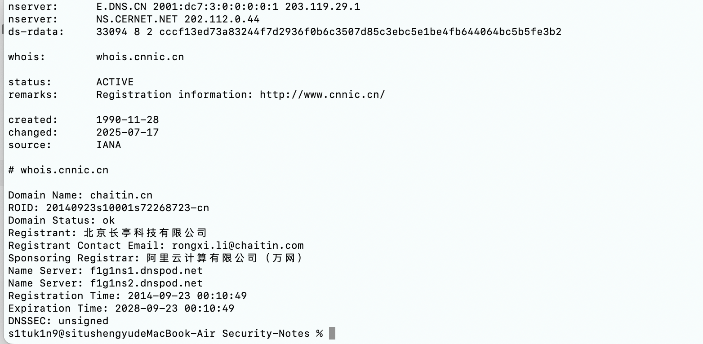

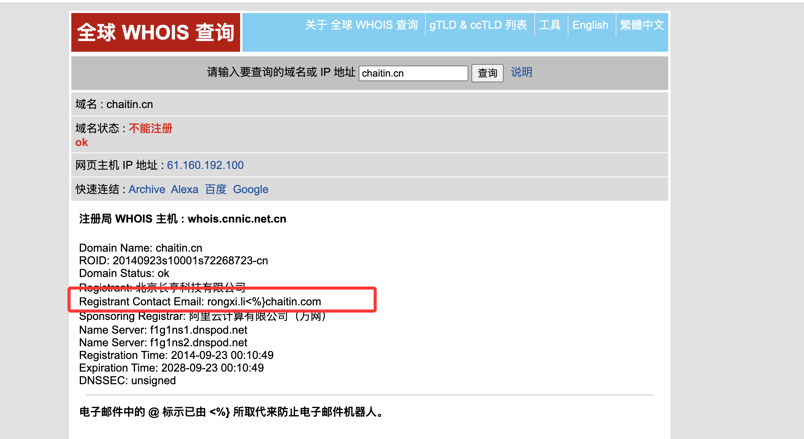

---

### 1.4  邮箱信息收集
- **定义**：通过公开数据库、泄露平台或搜索引擎，收集域名相关的邮箱信息。  
- **常用方式**：  
  
  - Google Hack：`“@example.com”` 搜索，最常见的是hr或者领导的邮箱，可进行定向钓鱼。  
  - ```
    site:target.com intext:@target.com
    site:target.com 邮件
    site:target.com email
    ```
  
  - 邮箱泄露平台（如 Have I Been Pwned）。  
  - 社工库（灰产风险，课堂仅作介绍）。  

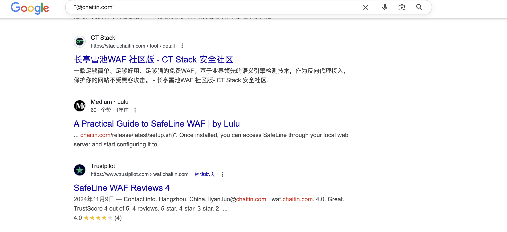

- **可获取信息**：  
  - 企业常用邮箱格式（如 `name@example.com`）。  
  - 泄露的员工账号与密码（历史泄露库）。  
- **安全意义**：  
  - 攻击者可利用收集到的邮箱尝试密码爆破、钓鱼邮件。  
  - 企业安全人员可监测邮箱是否出现在泄露库中，及时进行账号安全加固。  

## 2.子域名收集

子域名收集是网络安全信息收集的重要环节。一个组织的子域名可能暴露出不同的业务系统，其中一些可能防护不足或已被遗忘，往往成为攻击者突破的入口。  

---

### 2.1 收集子域名的意义
- **扩大攻击面**：子域名对应的系统可能与主域名不同，甚至存在旧业务系统或测试环境。  
- **发现敏感系统**：如后台管理系统、OA、VPN、邮件系统。  
- **检测安全盲区**：帮助企业发现自己未监控到的业务资产。  
- **典型案例**：很多真实攻击事件中，攻击者往往是通过一个“被遗忘的子域名”渗透进企业内部。  

---

### 2.2 HTTPS 证书
- **思路**：HTTPS 证书中通常会包含该域名及其子域名。  
- **方法**：  
  - 使用 `crt.sh` 等证书透明度日志平台查询。  
  - 示例：`https://crt.sh/?q=example.com`。  
- **意义**：发现企业申请过的子域名，即使网站已下线，也能暴露资产痕迹。  

##### 证书透明度公开日志枚举

证书透明度(Certificate Transparency, CT)是证书授权机构(CA) 的一个项目，证书授权机构会将每个SSL/TLS证书发布到公共日志中。一个SSL/TLS证书通常包含域名、子域名和邮件地址， 这些也经常成为攻击者非常希望获得的有用信息。查找某个域名所属证书的最简单的方法就是使用搜索引|擎搜索一些公开的CT日志。

##### 在线第三方平台查询

- crt.sh(https://crt.sh/)
- censys(https://censys.io/)
- myssl(https://myssl.com/)

```
crt:
https://crt.sh/?q=baidu.com
```

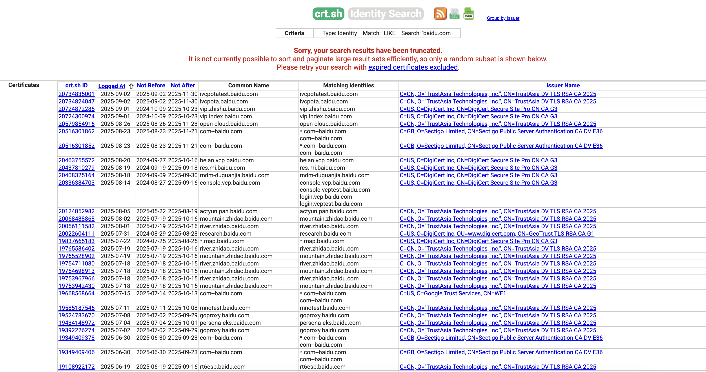

---

### 2.3 威胁情报平台
- **常用平台**：FOFA、ZoomEye、Shodan、Quake、Hunter。  
- **功能**：  
  - 通过关键字、域名查询子域名。  
  - 查看子域名对应的 IP、端口、开放服务。  
- **意义**：结合被动情报平台，能快速建立资产画像。  

---

### 2.4 网站内部信息
- **思路**：目标网站页面可能包含子域名信息。  
- **方法**：  
  - 查看 HTML 源码中的链接（如 `sub.example.com`）。  
  - JS 文件、CSS 文件中也可能引用子域名。  
  - robots.txt 文件中可能包含子域名路径。  
- **意义**：属于典型的“信息泄露”，攻击者可利用搜索引擎辅助收集。  

---

### 2.5 搜索引擎
- **思路**：利用 Google Hacking 或百度搜索查询子域名。  
- **常用语法**：  
  - `site:example.com -www` → 查找非 www 的子域名。  
  - `inurl:sub.example.com` → 查找特定子域名。  
- **意义**：搜索引擎可能收录到平时难以发现的子域名。  

Google语法查询

搜索子域名 "site:xxxxx"

```
site:baidu.com
```


FOFA语法查询

- fofa.so(https://fofa.info/)

搜索子域名 "domain:xxxxx"

```
domain="baidu.com"
```

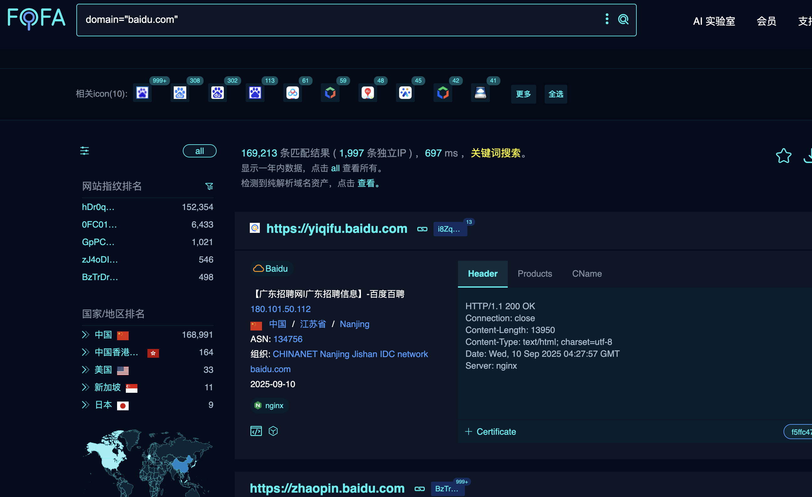

---

### 2.6 泛解析
- **定义**：域名解析中，将所有未配置的子域名统一解析到同一 IP。  
- **方法**：尝试访问随机子域名，如 `xxxxxx.example.com`。  
- **风险**：攻击者可能构造恶意子域名进行钓鱼攻击，或利用子域名接管漏洞。  

---

### 2.7 域传送漏洞（Zone Transfer）
- **定义**：DNS 区域传送本应只允许主从 DNS 服务器之间通信，如果配置错误，外部攻击者可获取完整的子域名清单。  
- **命令演示**：  
  
  ```bash
  dig axfr example.com @dns.example.com


- **意义**：一旦成功，几乎可以瞬间拿到所有子域名。
- 详细过程可参考：https://qftm.github.io/Information_Collection_Handbook/subdomain_info/dns_domain_send.html


### 2.8 Passive DNS

- **定义**：被动 DNS 是安全公司收集的历史 DNS 解析记录数据库。
- **常用平台**：VirusTotal、RiskIQ、DNSDB。
- **意义**：
  - 发现曾经解析过的子域名，即使目标已删除。
  - 有助于还原企业的历史资产。

------

### 2.9 DNS 解析记录

- **思路**：查询不同类型的 DNS 记录，有助于发现子域名。

- **常见类型**：

  - A 记录 → 子域名与 IP 映射。
  - MX 记录 → 邮件服务器子域名。
  - TXT 记录 → 可能包含第三方验证信息。

- **方法**：

  ```bash
  dig mx example.com
  dig txt example.com
  ```

- **意义**：有时可以通过邮件、云服务配置泄露额外的子域名。

------

### 2.10 常用子域名收集工具

- **常见子域名收集工具**：

| 工具名称   | 下载地址                                        | 工具描述                                                     |
| ---------- | ----------------------------------------------- | ------------------------------------------------------------ |
| Layer      | https://github.com/euphrat1ca/LayerDomainFinder | Layer子域名挖掘机，适合快速发现目标的子域名资产              |
| OneForAll  | https://github.com/shmilylty/OneForAll          | 功能强大的子域收集工具，支持多种数据源和接口                 |
| subdomain  | https://rapiddns.io/subdomain                   | 在线子域名爆破工具，支持简单快速查询                         |
| subfinder  | https://github.com/projectdiscovery/subfinder   | 快速的被动子域枚举工具，支持多平台集成                       |
| dnsub      | https://github.com/yunxu1/dnsub                 | 好用且强大的子域名扫描工具，支持多线程                       |
| Hosts_scan | https://github.com/fofapro/Hosts_scan           | 用于 IP 和域名碰撞匹配访问的小工具                           |
| hostscan   | https://github.com/cckuailong/hostscan          | 自动化 Host 碰撞工具，帮助红队快速扩展网络边界，获取更多目标点 |

- **自动化思路**：
  - 综合多种方法（证书、搜索引擎、情报平台）。
  - 将结果去重合并，形成子域名资产清单。

---

## 3.旁站、C段

旁站与 C 段扫描是渗透测试和资产摸底中常用的信息收集手段，通过这些方法可以发现目标关联的其他网站或系统，扩大攻击面。  

---

### 3.1 什么是旁站、C 段

#### 3.1.1 旁站（Neighboring Sites）
- **定义**：与目标网站位于同一服务器或同一 IP 上的其他网站。  
- **形成原因**：共享虚拟主机或同一个云服务 IP。  
- **安全意义**：  
  - 旁站可能安全防护较弱，成为攻击入口。  
  - 利用旁站漏洞，有时可以间接影响目标主站。  

#### 3.1.2 C 段（Class C Subnet）
- **定义**：IPv4 地址按照 A/B/C 类划分，C 段通常指同一 **/24 网段**，即 IP 前 3 段相同的 256 个地址。  
- **示例**：  
  - 目标 IP：192.168.1.50  
  - 同一 C 段：192.168.1.0 ~ 192.168.1.255  
- **安全意义**：  
  - 同一 C 段可能托管同一企业的多个业务系统。  
  - 通过扫描 C 段，可以发现目标相关的内部或外部资产。  

---

### 3.2 扫描旁站、C 段的意思
- **扫描旁站**：在同一 IP 或服务器上，查找与目标网站同机的其他站点。  
- **扫描 C 段**：对目标 IP 所在网段的 256 个地址进行扫描，发现可能的其他目标系统。  
- **目标**：  
  - 发现未公开或遗留的业务系统。  
  - 找到安全防护薄弱的网站或接口。  

---

### 3.3 如何进行 C 段扫描
#### 3.3.1 信息准备
- 确定目标 IP 或域名，获取其所属网段。  
- 例如：`目标域名 example.com → IP: 192.168.1.50 → 网段: 192.168.1.0/24`  

#### 3.3.2 扫描方法
1. **Ping 扫描**  
   - 检测网段内哪些 IP 活跃。  
   - 工具示例：`fping`、`nmap -sn 192.168.1.0/24`  

2. **端口扫描**  
   - 对活跃 IP 扫描常用端口，发现开放服务。  
   - 工具示例：`nmap -p 80,443,8080 192.168.1.0/24`  

3. **旁站发现**  
   - 对扫描到的 IP，使用虚拟主机探测方法，发现同机站点。  
   - 方法：发送 HTTP 请求，遍历可能的 Host 头或子域名，观察响应。  

4. **自动化扫描**  
   - 使用脚本或工具批量扫描 C 段并收集信息。  

#### 3.3.3 注意事项
- 扫描范围需合法授权，否则属于入侵行为。  
- 扫描频率不要过高，以免触发防护或被误报。  

---

### 3.4 常用工具
| 工具名称             | 功能描述                                       | 备注                      |
| -------------------- | ---------------------------------------------- | ------------------------- |
| Nmap                 | 网络扫描器，可进行 Ping、端口扫描、C 段扫描    | 命令行操作，灵活可脚本化  |
| Masscan              | 高速端口扫描工具，适合大网段扫描               | 高速，但需谨慎控制速率    |
| httpx                | 扫描 IP/域名是否存在 HTTP 服务，辅助发现旁站   | 被动/主动结合             |
| EyeWitness           | Web 服务截图工具，方便快速识别旁站网站         | 可配合 httpx 或 nmap 使用 |
| WhatWeb / Wappalyzer | 网站指纹识别工具，可分析旁站技术栈             | 有助于判断潜在漏洞        |
| Python 自定义脚本    | 批量遍历 C 段 IP，尝试访问 HTTP 服务并识别旁站 | 灵活，适合课堂演示        |

#### 3.4.1 nmap进行扫描C段

1.扫描准备

- **确认目标网段**  
  例如：目标 IP 为 `192.168.1.50`，对应 C 段为 `192.168.1.0/24`。  
- **安装 Nmap**  
  - Linux：`sudo apt install nmap` 或 `sudo yum install nmap`  
  - Windows：下载安装包 [https://nmap.org/download.html](https://nmap.org/download.html)  

2.常用扫描命令示例

2.1 Ping 扫描（发现活跃主机）

```bash
nmap -sn 192.168.1.0/24
```
- `-sn`：只进行主机发现，不扫描端口。
- 输出示例：

```
Nmap scan report for 192.168.1.1
Host is up (0.0031s latency).
Nmap scan report for 192.168.1.50
Host is up (0.0012s latency).
```

> 可快速识别网段中存活的 IP。

2.2 常用端口扫描

```bash
nmap -p 80,443 192.168.1.0/24
```

- 扫描网段内所有主机的 80、443 端口。
- 输出示例：

```
Nmap scan report for 192.168.1.50
PORT    STATE SERVICE
80/tcp  open  http
443/tcp open  https
```

2.3 扫描全部端口并发现服务

```bash
nmap -sS -sV -p- 192.168.1.0/24
```

- `-sS`：TCP SYN 扫描（隐蔽高效）
- `-sV`：服务版本探测
- `-p-`：扫描所有 65535 个端口

#### 3.4.2 在线工具进行扫描C段

1.在线工具

https://c.webscan.cc/

2.扫描C段和旁站

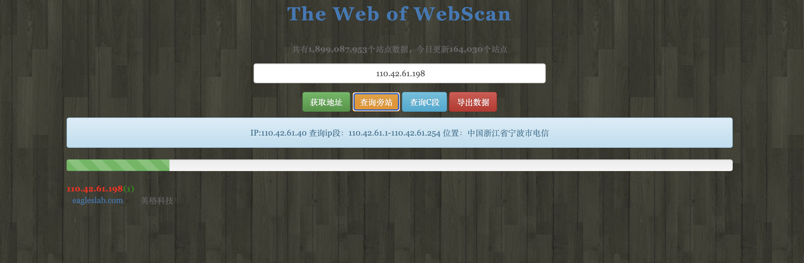

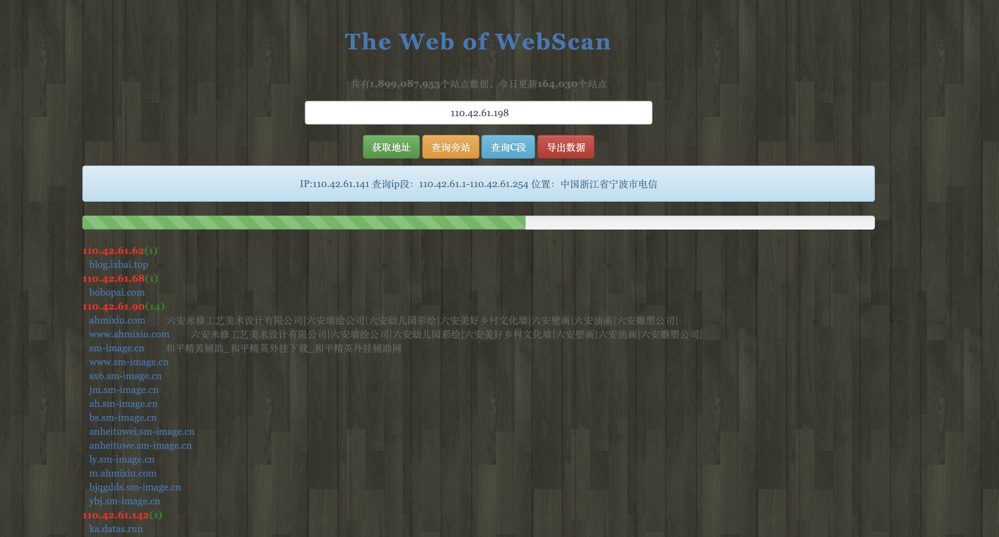
