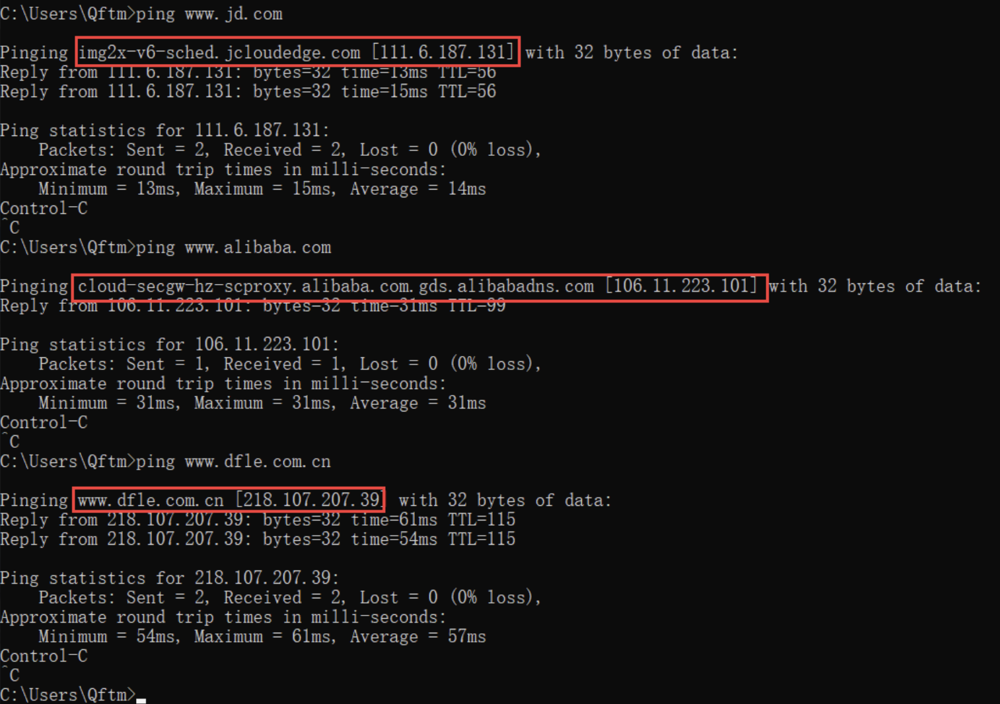
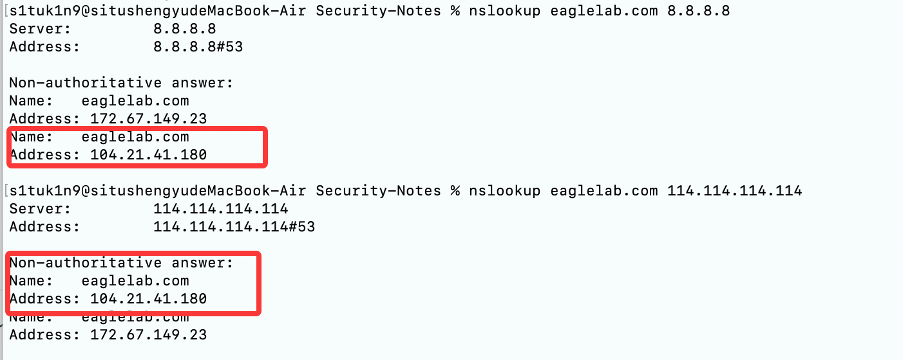
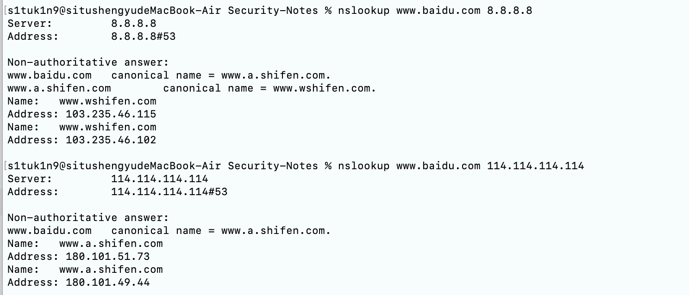
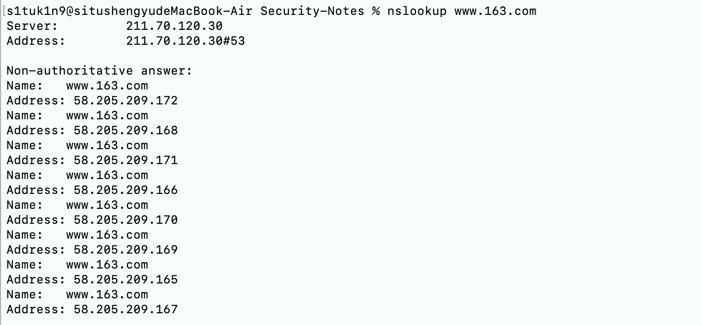
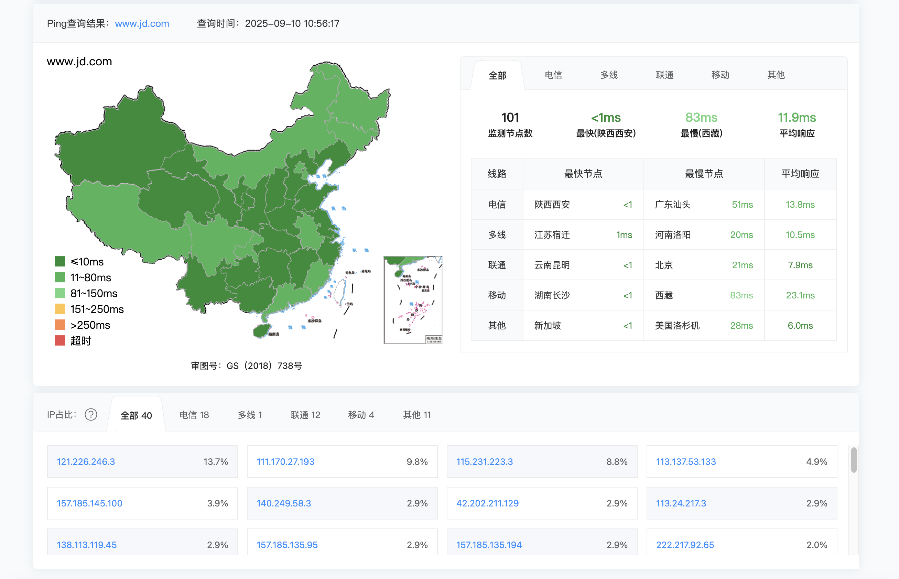
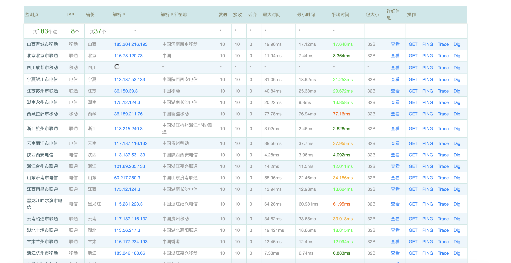
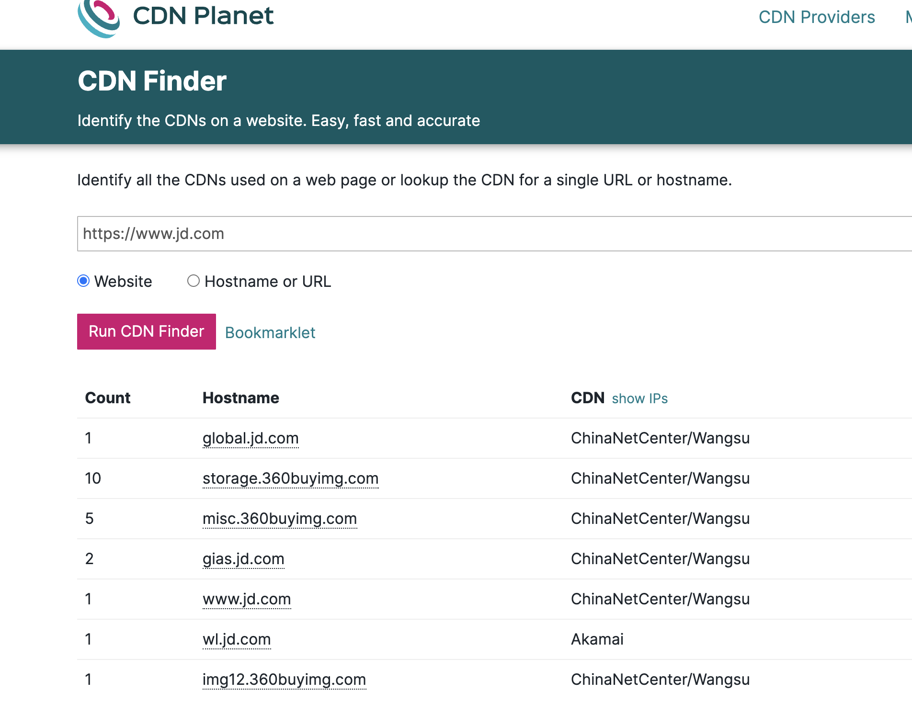
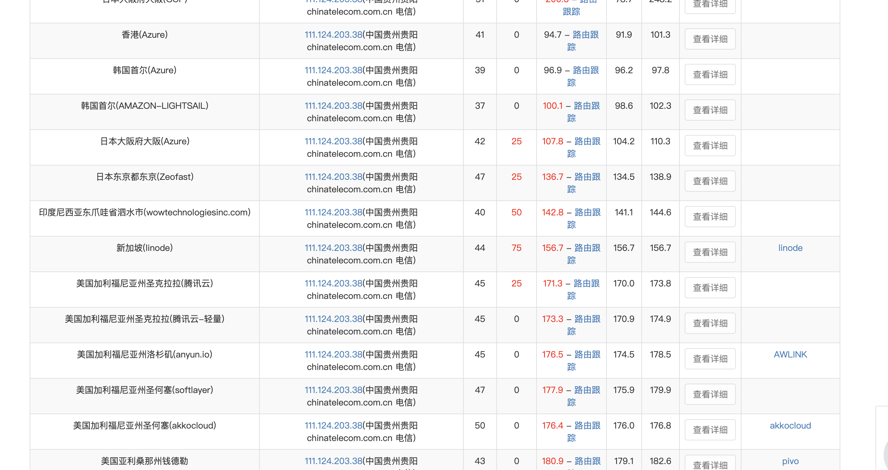
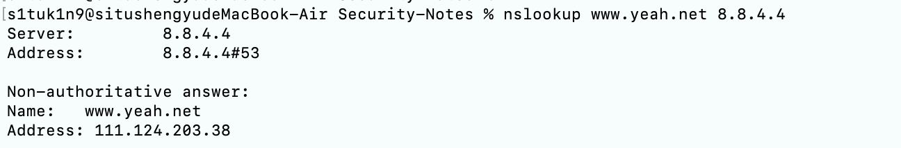

# 03.CDN识别

## 3.1 CDN 简介
- **定义**  
  CDN的全称是Content Delivery Network，即内容分发网络。其基本思路是尽可能避开互联网上有可能影响数据传输速度和稳定性的瓶颈和环节，使内容传输的更快、更稳定。通过在网络各处放置节点服务器所构成的在现有的互联网基础之上的一层智能虚拟网络，CDN系统能够实时地根据网络流量和各节点的连接、负载状况以及到用户的距离和响应时间等综合信息将用户的请求重新导向离用户最近的服务节点上。
  
- **主要功能**  
  1. **加速**：减少访问延迟，提高网站访问体验。  
  2. **高可用性**：通过多节点分布，避免单点故障。  
  3. **抗攻击**：CDN 节点能隐藏真实服务器 IP，并具备 DDoS 防护能力。  
  
- **对安全的影响**  
  
  - 渗透测试时，扫描的 IP 可能是 CDN 节点，而非真实目标主机。  
  - 需要通过一定方法绕过 CDN，获取真实 IP，才能进一步攻击。  
  
- **为什么都喜欢用CDN？**

  咱先想象个场景：你人在北京，想访问深圳某公司的官网。这时候数据得从深圳跑到北京，2000 多公里呢，路上说不定还堵车（网络延迟高），打开网页得等老半天。**CDN 咋解决这问题呢？** 网站把常用的 "热门内容"，比如首页、产品图片这些，提前存到北京的中转站（CDN 节点）。你访问的时候，直接从中转站拿数据，就像在本地超市买东西，速度嗖一下就提上来了，延迟能降低 50% 以上。**说白了**：CDN 就是内容分发网络，靠分布在全球的无数个中转站，把网站内容缓存到离用户最近的地方，既能减轻源站压力，又能让用户访问更快。

- **为啥说 CDN 是 "拦路虎"？**
  - **藏起真实 IP**：咱们平时 ping 域名，拿到的都是 CDN 中转站的 IP（比如阿里云、腾讯云的节点 IP），真正的源站 IP（服务器真实地址）被藏得严严实实。
  - **增加攻击难度**：搞渗透测试得先找到源站 IP 才行啊！要是对着中转站一顿操作，全是无用功，根本打不到真实服务器。

---

## 3.2 CDN的工作原理

捋一遍用户访问带 CDN 网站的流程：

1. **用户发起请求**：在浏览器输入www.xxx.com，浏览器先去做 DNS 解析，也就是把域名翻译成 IP 地址。
2. **DNS 返回 CDN 节点 IP**：域名解析的时候，CDN 服务商会根据你的位置，返回离你最近的节点 IP。比如你在上海，就给你上海的节点 IP。
3. **节点处理请求**：
   - **有缓存内容**：比如你访问的是首页，中转站里已经存了，直接返回给你，不用经过源站。
   - **没缓存内容**：比如登录接口这种动态内容，中转站就会向源站（真实服务器）要数据，拿到后再转发给你。
4. **你看到的都是节点 IP**：整个过程中，你的请求压根没到源站，所以不管是抓包还是扫描，拿到的都是中转站的 IP。

## 3.3 如何判断网站是否使用 CDN

由于CDN需要代价，一般小企业很大几率不会存在CDN服务。

假如一些企业存在CDN服务，那该如何寻找其真实IP呢，常见几种手法

### 3.3.1 Ping目标主域

通常通过ping目标主域，观察域名的解析情况，以此来判断其是否使用了CDN

对京东和阿里还有一家电器企业进行ping测试，观察域名的解析情况，可以看到京东和阿里都采用了自家CDN，而那个电器企业没有CDN服务

```
ping www.jd.com

ping www.alibaba.com

ping www.dfle.com.cn
```



### 3.3.2 Nslookup

#### 1.不同DNS域名解析

不同DNS域名解析情况对比，判断其是否使用了CDN

不同DNS解析结果若不一样，很有可能存在CDN服务

```
nslookup www.dfle.com.cn 8.8.8.8

nslookup www.dfle.com.cn 114.114.114.114
```



```
nslookup www.baidu.com 8.8.8.8

nslookup www.baidu.com 114.114.114.114
```



#### 2.nslookup默认解析

若解析结果有多个，很有可能存在CDN，相反，若解析结果有一个，可能不存在CDN(不能肯定)



### 3.3.3 全国Ping

利用全国多地区的ping服务器操作，然后对比每个地区ping出的IP结果，查看这些IP是否一致， 如果都是一样的，极有可能不存在CDN。如果IP大多不太一样或者规律性很强，可以尝试查询这些IP的归属地，判断是否存在CDN。

在线网址

- Ping检测-站长工具(http://ping.chinaz.com/)
- 17CE(https://www.17ce.com/)
- ipip (支持国内、国外)(https://tools.ipip.net/newping.php)

#### 1.站长工具

测试目标：`www.jd.com`



#### 2.17CE



### 3.3.4 工具查询

这里工具只能作为辅助，有一定误报的概率，只能作为参考

#### 1.Cdnplanet

- cdnplanet(https://www.cdnplanet.com/tools/cdnfinder/) （查询可能比较慢）



## 3.4 国内外CND

国内常见CDN

```
阿里云
腾讯云
百度云
网宿科技(ChinanNet Center)
蓝汛
金山云
UCloud
网易云
世纪互联
七牛云
京东云等
```

国外常见CDN

```
Akamai(阿卡迈)
Limelight Networks(简称LLNW)
AWS Cloud(亚马逊)
Google(谷歌)
Comcast(康卡斯特)
```

## 3.5 绕过CDN查找真实IP

在确认了目标确实用了CDN以后，就需要绕过CDN寻找目标的真实IP，下面介绍一些常规的方法。

### 3.5.1 国外请求

很多时候国内的CDN对国外得覆盖面并不是很广，故此可以利用此特点进行探测。通过国外代理访问就能查看真实IP了，或者通过国外的DNS解析，可能就能得到真实的IP。

#### 1.国际Ping

国际ping测试站点

- ipip(https://tools.ipip.net/newping.php)

测试站点：`www.yeah.net`



#### 2.国外DNS解析

- 测试站点：`www.yeah.net`

美国加利福尼亚州山景市谷歌公司DNS服务器： `8.8.4.4`



### 3.5.2 分站域名&C段查询

很多网站主站的访问量会比较大，所以主站都是挂CDN的，但是分站可能没有挂CDN,可以通过ping二级域名获取分站IP， 可能会出现分站和主站不是同一个IP但在同一个C段下面的情况，从而能判断出目标的真实IP段。

- 参考子域名收集及C段章节

### 3.5.3 查询域名历史DNS解析记录

一般网站从部署开始到使用cdn都有一个过程，周期如果较长的话 则可以通过这类历史解析记录查询等方式获取源站ip，查看IP与域名绑定的历史记录，可能会存在使用CDN前的记录。

在线网站查询

- [NETCRAFT](https://sitereport.netcraft.com/?url=)
- [viewdns](https://viewdns.info/)
- [threatbook](https://x.threatbook.cn/)
- [securitytrails](https://securitytrails.com/)

### 3.5.4 利用邮件服务（针对有联系邮箱的站点）

- **原理**：网站的联系邮箱，比如admin@xxx.com，在发送邮件时，邮件头信息里会暴露源站 IP，因为邮件服务器通常直接连接源站。

- 操作步骤：
  - 1.给网站的联系邮箱发一封邮件，比如注册时的找回密码邮件，或者随便发个咨询邮件。
  - 2.查看邮件源码（以 QQ 邮箱为例，打开邮件后，点击右上角的 "更多"，选择 "显示邮件原文"）。
  - 3.在源码里搜索Received字段，会看到类似这样的内容：


### 3.5.5 找未被 CDN 代理的端口 / 服务

- **原理**：CDN 通常只代理 80 和 443 端口（Web 服务），像 22（SSH）、3389（RDP）、3306（MySQL）这些端口，很多企业没给它们加 CDN，直接暴露源站。

- 操作步骤：

  - 1.用 nmap 扫描域名的所有端口：

    ```nmap -sS -p1-65535 xxx.com  # -sS是半开扫描，隐蔽性好；-p1-65535扫描所有端口```

  - 2.重点分析非 80/443 端口的 IP：

    - 比如扫描结果显示 22 端口开放，对应的 IP 不是 CDN 节点 IP（CDN 一般不代理 SSH 端口），那这个 IP 就是真实服务器的 IP，直接冲着这个 IP 去渗透，成功率很高。**注意**：有些财大气粗的企业，可能给所有端口都加了 CDN，这时候就需要结合其他方法一起用了。

