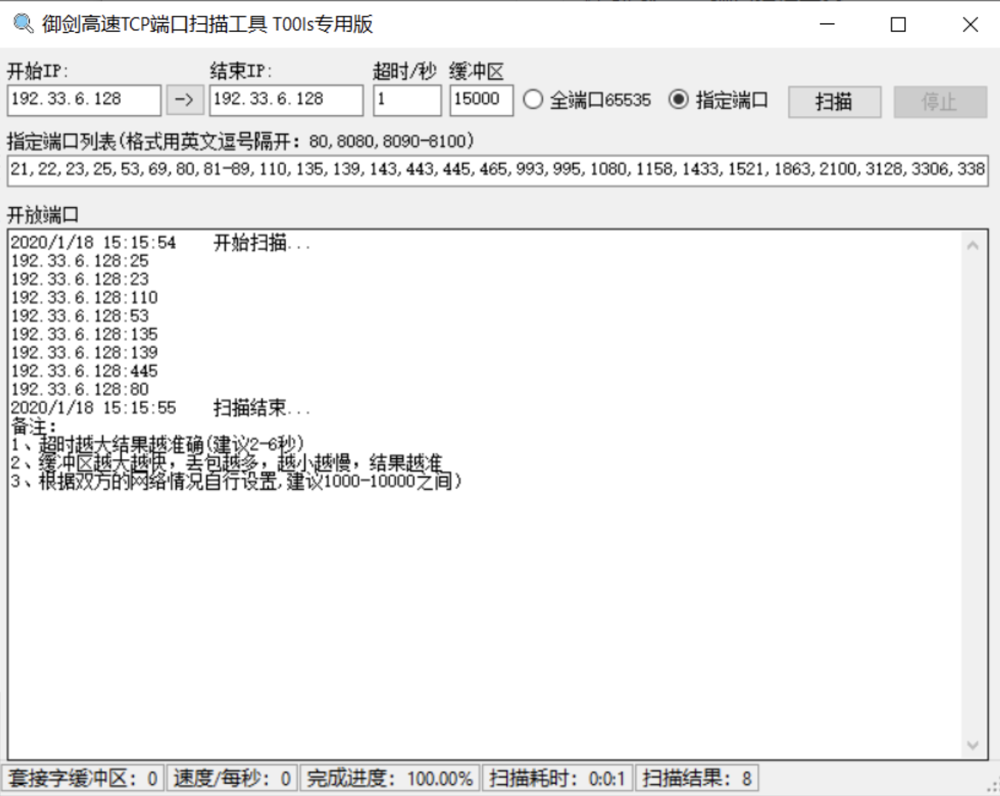

# 04.常用端口信息

## 1.端口介绍

### 1.1 IP、端口、服务的关系

#### 1.1.1 IP 地址
- **定义**：在网络中唯一标识一台设备，相当于“门牌号”。  
- **作用**：用于主机之间的定位与通信。  
- **分类**：  
  - **IPv4**（32 位，常见格式如 `192.168.1.1`）  
  - **IPv6**（128 位，更大地址空间，如 `2408:843e:325:23::1`）  

#### 1.1.2 端口
- **定义**：主机内部区分不同服务或进程的“编号”，相当于“房间号”。  
- **范围**：0 - 65535，共 65536 个端口。  
- **特点**：  
  - 一个 IP 可以运行多个服务，通过不同端口区分。  
  - TCP 和 UDP 协议各自有独立的 65535 个端口。  

#### 1.1.3 服务
- **定义**：运行在端口上的具体应用或功能。  
- **示例**：  
  - IP：192.168.1.10  
  - 端口：80  
  - 服务：HTTP Web 服务  
  - 关系：用户访问 `http://192.168.1.10:80` → 浏览器与该 Web 服务通信。  

#### 1.1.4 形象类比
- **IP 地址**：小区门牌号  
- **端口号**：房间号  
- **服务**：房间内提供的功能（卧室=休息，餐厅=吃饭，书房=学习）  

---

### 1.2 端口分类

#### 1.2.1 知名端口（Well-known Ports）
- 范围：0 - 1023  
- **分配给特定服务，由 IANA 规定**。  
- 常见示例：  
  - 21：FTP 文件传输  
  - 22：SSH 安全远程连接  
  - 25：SMTP 邮件发送  
  - 80：HTTP 网页访问  
  - 443：HTTPS 加密网页访问  

#### 1.2.2 注册端口（Registered Ports）
- 范围：1024 - 49151  
- **应用程序可使用，但也可能被恶意服务占用**。  
- 常见示例：  
  - 1433：Microsoft SQL Server  
  - 1521：Oracle 数据库  
  - 3306：MySQL 数据库  
  - 3389：Windows 远程桌面 RDP  

#### 1.2.3 动态/私有端口（Dynamic/Private Ports）
- 范围：49152 - 65535  
- **由操作系统临时分配，用于客户端与服务端通信**。  
- 示例：  
  - 用户访问百度（80 端口），本地系统可能分配一个 `51723` 临时端口进行会话。  
  - 浏览器关闭后，端口自动释放。  

---

### 1.3 端口与协议的关系
- **TCP（传输控制协议）**  
  - 面向连接，可靠传输，三次握手。  
  - 常见服务：HTTP(80)、HTTPS(443)、SSH(22)、FTP(21)。  

- **UDP（用户数据报协议）**  
  - 无连接，传输速度快，不保证可靠性。  
  - 常见服务：DNS(53)、TFTP(69)、SNMP(161)。  

---

### 1.4 端口状态
Nmap 等扫描工具常用的端口状态：  
- **open**：端口开放并有服务监听。  
- **closed**：端口关闭，没有服务监听，但主机在线。  
- **filtered**：端口被防火墙/过滤，无法确定是否开放。  
- **unfiltered**：端口可达，但是否开放未知。  
- **open|filtered**：不确定是开放还是被过滤。   

---

## 2.常用端口和服务

```
端口：21 服务：FTP/TFTP/VSFTPD 总结：爆破/嗅探/溢出/后门
端口：22 服务：ssh远程连接      总结：爆破/openssh漏洞
端口：23 服务：Telnet远程连接   总结：爆破/嗅探/弱口令
端口：25 服务：SMTP邮件服务     总结：邮件伪造
端口：53 服务：DNS域名解析系统   总结：域传送/劫持/缓存投毒/欺骗
端口：67/68 服务：dhcp服务      总结：劫持/欺骗
端口：110 服务：pop3              总结：爆破/嗅探
端口：139 服务：Samba服务         总结：爆破/未授权访问/远程命令执行
端口：143 服务：Imap协议         总结：爆破161SNMP协议爆破/搜集目标内网信息
端口：389 服务：Ldap目录访问协议 总结：注入/未授权访问/弱口令
端口：445 服务：smb              总结：ms17-010/端口溢出
端口：512/513/514 服务：Linux Rexec服务 总结：爆破/Rlogin登陆
端口：873 服务：Rsync服务                 总结：文件上传/未授权访问
端口：1080 服务：socket                  总结：爆破
端口：1352 服务：Lotus domino邮件服务   总结：爆破/信息泄漏
端口：1433 服务：mssql                  总结：爆破/注入/SA弱口令
端口：1521 服务：oracle       总结：爆破/注入/TNS爆破/反弹shell2049Nfs服务配置不当
端口：2181 服务：zookeeper服务            总结：未授权访问
端口：2375 服务：docker remote api    总结：未授权访问
端口：3306 服务：mysql                 总结：爆破/注入
端口：3389 服务：Rdp远程桌面链接        总结：爆破/shift后门
端口：4848 服务：GlassFish控制台       总结：爆破/认证绕过
端口：5000 服务：sybase/DB2数据库      总结：爆破/注入/提权
端口：5432 服务：postgresql             总结：爆破/注入/缓冲区溢出
端口：5632 服务：pcanywhere服务        总结：抓密码/代码执行
端口：5900 服务：vnc                     总结：爆破/认证绕过
端口：6379 服务：Redis数据库           总结：未授权访问/爆破
端口：7001/7002 服务：weblogic         总结：java反序列化/控制台弱口令
端口：80/443 服务：http/https         总结：web应用漏洞/心脏滴血
端口：8069 服务：zabbix服务            总结：远程命令执行/注入
端口：8161 服务：activemq             总结：弱口令/写文件
端口：8080/8089 服务：Jboss/Tomcat/Resin 总结：爆破/PUT文件上传/反序列化
端口：8083/8086 服务：influxDB         总结：未授权访问
端口：9000 服务：fastcgi                 总结：远程命令执行
端口：9090 服务：Websphere             总结：控制台爆破/java反序列化/弱口令
端口：9200/9300 服务：elasticsearch   总结：远程代码执行
端口：11211 服务：memcached             总结：未授权访问
端口：27017/27018 服务：mongodb         总结：未授权访问/爆破
```

---

## 3.端口扫描

### 3.1 端口扫描的目的
端口扫描是渗透测试和网络安全分析中最常用的步骤之一，主要目的：

1. **识别存活主机**  
   - 判断目标主机是否在线，是否能够响应网络请求。  
   - 在渗透测试前排除掉无效目标，提高效率。  
2. **发现开放端口**  
   - 探测目标系统中哪些端口处于开放状态。  
   - 通过端口可以推测出目标运行的服务类型（如 80/443 → Web 服务，3306 → MySQL）。  
3. **识别服务类型与版本**  
   - 不同的端口对应着不同的服务。（如 80/443 → Web 服务，3306 → MySQL）。  
   - 通过端口扫描，可以进一步进行 **服务指纹识别**，确定服务版本。  
4. **发现潜在漏洞点**  
   - 开放的端口和运行的服务可能存在漏洞。  
   - 如： FTP（21）、Telnet（23）或Redis（6379），可能意味着存在未授权访问风险。  

---

### 3.2 常见端口扫描工具

| 工具名称                    | 特点与功能                                                   | 适用场景               |
| --------------------------- | ------------------------------------------------------------ | ---------------------- |
| **Nmap**                    | 最常用的网络扫描工具，支持主机发现、端口扫描、服务版本识别、操作系统探测等功能。 | 通用渗透测试、网络排查 |
| **Masscan**                 | 世界上速度最快的端口扫描器，能够在几分钟内扫描整个互联网。   | 大规模互联网资产测绘   |
| **Zmap**                    | 专注于高速互联网范围扫描，适合科研与互联网安全监测。         | 互联网全网扫描         |
| **御剑高速TCP端口扫描工具** | 图形化界面，渗透过程中常用的高速端口扫描工具。               | 专业渗透测试           |

#### 3.2.1 Nmap

项目地址：`https://github.com/nmap/nmap`

- 扫描多个IP

```
扫描整个子网 nmap 192.168.6.1/24
           nmap 192.168.1.1/16
           nmap 192.168.1-30.1-254
           nmap 192.168.1-254.6
扫描多个主机 namp 192.168.6.2 192.168.6.6
扫描一个小范围 nmap 192.168.6.2-10
扫描txt内的ip列表  nmap -iL text.txt
扫描除某个目标外   nmap 192.168.6.1/24 -exclude 192.168.6.25
```

- 绕过Firewalld扫描主机端口

通过不同的协议(TCP半连接、TCP全连接、ICMP、UDP等)的扫描绕过Firewalld的限制

```
nmap -sP 192.33.6.128
nmap -sT 192.33.6.128
nmap -sS 192.33.6.128
nmap -sU 192.33.6.128
nmap -sF 192.33.6.128
nmap -sX 192.33.6.128
nmap -sN 192.33.6.128
```

- 初步扫描端口信息

```
nmap -T4 -A -v -Pn 192.168.1.1/24 -p 21,22,23,25,80,81,82,83,88,110,143,443,445,512,513,514,1433,1521,2082,2083,2181,2601,2604,3128,3306,3389,3690,4848,5432,5900,5984,6379,7001,7002,8069,8080,8081,8086,8088,9200,9300,11211,10000,27017,27018,50000,50030,50070 -oN nmap_result.txt
```

#### 3.2.2 Masscan

项目地址：`https://github.com/robertdavidgraham/masscan`

Masscan主要是真对全网进行端口扫描

#### 3.2.3 Zmap

项目地址：`https://github.com/zmap/zmap`

Zmap主要是真对全网进行端口扫描

#### 3.2.4 御剑高速TCP端口扫描工具


