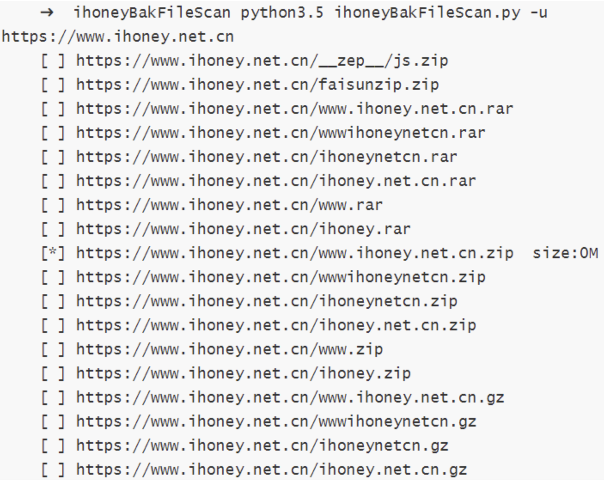
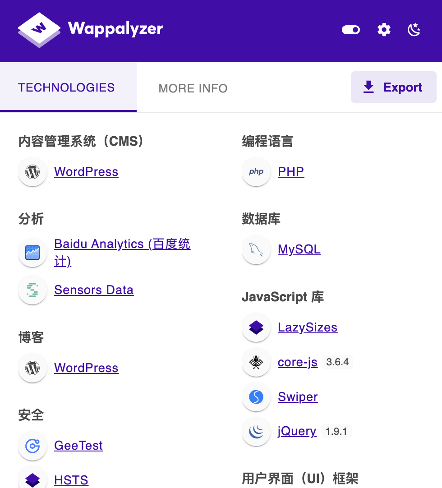
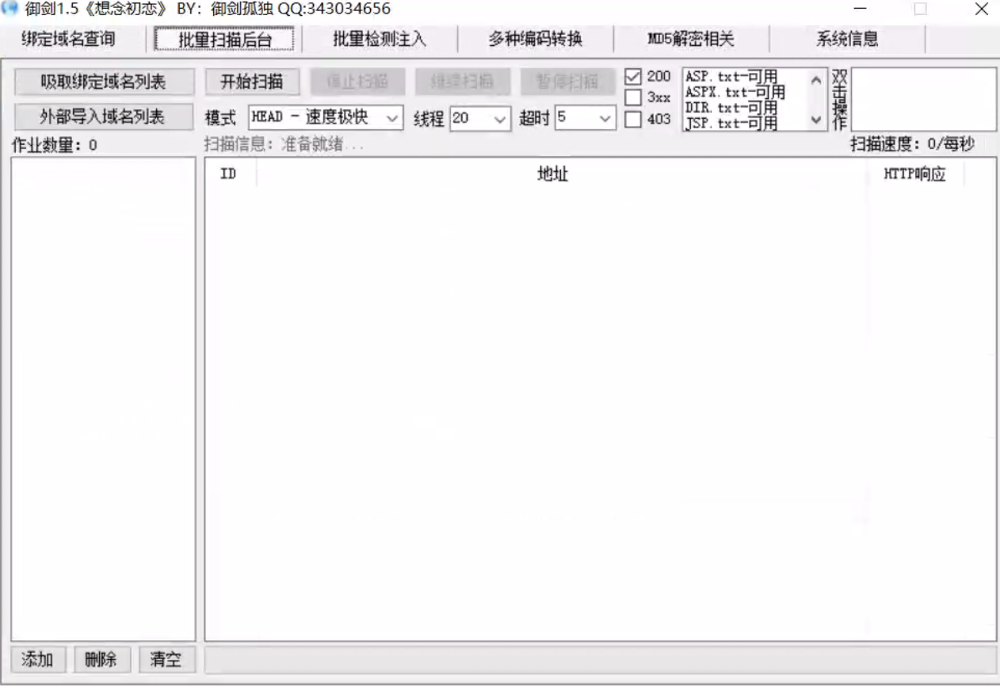
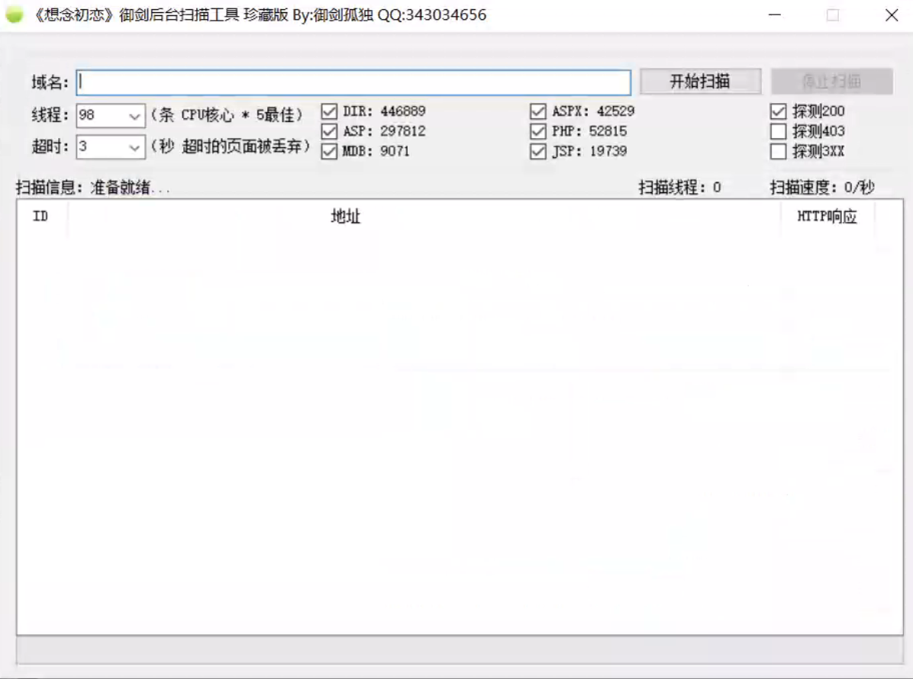
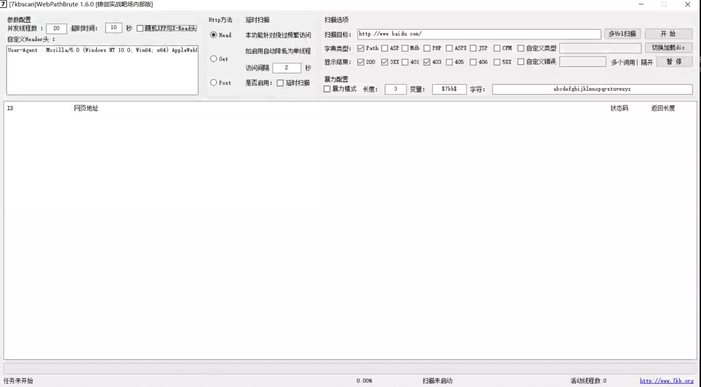

# 06.目录扫描

## 1.常见的敏感文件
### 1.1 robots.txt

- **定义**：网站根目录下的配置文件，用于告诉搜索引擎哪些页面或目录不允许爬取。  
- **安全隐患**：攻击者可以通过访问 `https://example.com/robots.txt`，轻松发现敏感目录（如 `/admin/`、`/backup/`）。  
- **示例**：https://vip.bdziyi.com/robots.txt
```
User-agent: *
Disallow: /wp-admin/
Allow: /wp-admin/admin-ajax.php

Sitemap: https://vip.bdziyi.com/wp-sitemap.xml
```
---

### 1.2. sitemap.xml

- **定义**：网站地图文件，主要用于搜索引擎优化（SEO），列出网站的重要页面。  
- **安全隐患**：暴露了网站完整的 URL 结构，攻击者可以快速发现隐藏的接口或后台页面。  
- **示例**：  
访问 `https://example.com/sitemap.xml` 可能泄露 `/test/`、`/beta/` 等未公开目录。

### 1.3 后台登录入口

- **定义**：管理人员登录后台的入口页面。常见路径有：
- `/admin/`
- `/login/`
- `/manage/`
- `/wp-admin/`（WordPress）  
- **安全隐患**：攻击者获取后台入口后，可以进一步进行 **弱口令爆破** 或 **SQL 注入** 攻击。  
- **防护方法**：通过验证码、IP 白名单、双因素认证等方式保护后台。

---

### 1.4 网站目录

- **定义**：服务器上存放网站代码、静态资源或配置文件的路径。  
- **常见泄露场景**：  
- Apache/Nginx 未关闭目录浏览功能，导致访问 `https://example.com/uploads/` 时能看到所有文件。  
- 误上传的 `.zip`、`.tar.gz` 备份文件（如 `www.zip`、`backup.tar.gz`）。  
- **危害**：攻击者可能直接下载源代码、配置文件，甚至获取数据库连接信息。

---

### 1.5 MySQL 的管理界面

- **常见路径**：  
- `phpMyAdmin/`
- `dbadmin/`
- `mysqladmin/`  
- **危害**：如果界面未加防护，攻击者可能尝试默认账号/弱口令（如 `root/root`）。  

---

### 1.6 敏感目录泄露

- **常见敏感目录**：
- `.git/`（Git 版本库）
- `.svn/`（SVN 版本库）
- `/backup/`（备份目录）
- `/test/`（测试环境）
- **危害**：  
- 版本库泄露可能导致源码被完整下载。  

---

### 1.7 Git 泄露

- **定义**：当网站服务器上遗留 `.git/` 目录时，攻击者可以直接下载代码仓库。  
- **攻击方式**：  
```bash
git clone http://example.com/.git/
```

- **危害**：
  - 获取网站源码。
  - 查看敏感配置信息（数据库账号、密钥）。
  - 分析 commit 历史，寻找开发人员误提交的信息。

---

### 1.8 Banner 识别

- **定义**：Banner 是指服务在对外提供时返回的标识信息（版本号、软件名称等）。
- **常见来源**：
  - Web 服务器（如 Apache/2.4.49, Nginx/1.20.1）
  - 数据库服务（如 MySQL 5.7.33）
  - SSH 服务（如 OpenSSH_7.9p1）
- **危害**：通过 Banner，攻击者可以快速定位漏洞（如某版本 Apache 存在 RCE 漏洞）。
- **防护建议**：关闭或混淆 Banner 信息，减少攻击面。

------

### 1.9 源码泄露

#### 1.9.1 常见源码泄露

```
/.bzr/
/CVS/Entries
/CVS/Root
/.DS_Store  MacOS自动生成
/.hg/
/.svn/ (/.svn/entries)
/.git/
/WEB-INF/src/
/WEB-INF/lib/
/WEB-INF/classes/
/WEB-INF/database.properties
/WEB-INF/web.xml

Robots.txt
```

上述源码泄露在Github上都可以找到相应的利用工具

#### 1.9.2 源码泄露扫描工具

将常见源码泄露加入字典配合FUZZ、御剑等扫描器进行扫描收集

#### 1.9.3 源码泄露利用工具

- .git源码泄露：https://github.com/lijiejie/GitHack
- .DS_Store泄露：https://github.com/lijiejie/ds_store_exp
- .bzr、CVS、.svn、.hg源码泄露：https://github.com/kost/dvcs-ripper

---

### 1.10 备份文件

#### 1.10.1 网站备份文件泄露常见名称

```
backup
db
data
web
wwwroot
database
www
code
test
admin
user
sql
```

#### 1.10.2 网站备份文件泄露常见后缀

```
.bak
.html
_index.html
.swp
.rar
.txt
.zip
.7z
.sql
.tar.gz
.tgz
.tar
```

#### 1.10.3 网站备份文件泄露扫描工具

常见扫描工具有：Test404网站备份文件扫描器 v2.0、ihoneyBakFileScan等

ihoneyBakFileScan v0.2 多进程批量网站备份文件泄露扫描工具，根据域名自动生成相关扫描字典，自动记录扫描成功的备份地址到文件



## 2.站点其他信息

### 2.1 操作系统识别
- **定义**：通过探测网络特征、协议行为和服务响应，识别目标主机所运行的操作系统。
- **常见系统类型**：
  - Windows Server 系列（IIS Web 服务常见于 Windows）
  - Linux 发行版（CentOS、Ubuntu、Debian 等）
  - BSD 系列（FreeBSD、OpenBSD）
- **识别方法**：
  - 使用 `nmap -O` 进行操作系统指纹识别。
  - 观察服务器响应头（如 `Server: Microsoft-IIS/10.0` → Windows）。
  - 分析网络 TTL 值（不同系统的默认 TTL 有差异）。
- 不同TTL值含义
  - **TTL（Time To Live）** 是 IP 报文头中的一个字段（8 位整数），原本用于限制数据包在网络中能经过的最大路由跳数，防止路由环路导致报文无限循环。  
  - 每经过一台路由器（hop），路由器会将报文的 TTL 减 1；当 TTL 减到 0 时，报文会被丢弃并通常产生 ICMP 超时消息。  

常见系统的“常用/默认”初始 TTL（常用参考）

| 初始 TTL 值 | 常见来源 / 说明                                              |
| ----------- | ------------------------------------------------------------ |
| **255**     | 路由器、网络设备、某些 Unix/Solaris / 也常见于网络设备（Cisco 等） |
| **128**     | Windows 家族（Windows 桌面/Server 的常见默认）               |
| **64**      | Linux / macOS / Android / 大多数 BSD 系统 的常见默认         |
| **32**      | 某些嵌入式设备或非常老的系统（出现较少）                     |

---

### 2.2 开发语言
- **定义**：网站后端使用的编程语言。
- **常见类型**：
  - PHP（WordPress、Discuz!、ThinkPHP）
  - ASP/ASP.NET（Windows 平台常见）
  - Java（Spring、Struts 框架）
  - Python（Django、Flask）
  - Ruby（Ruby on Rails）
- **识别方法**：
  - 通过文件后缀（如 `.php`、`.jsp`、`.aspx`）。
  - 抓取 HTTP 响应头（如 `X-Powered-By: PHP/7.4`）。
  - 根据错误提示页面信息推测（如 `JSP Error` → Java）。

---

### 2.3 前端框架
- **定义**：网站客户端使用的开发框架或库。
- **常见框架**：
  - jQuery、Bootstrap（经典前端框架）
  - React、Vue.js、Angular（现代前端框架）
- **识别方法**：
  - 查看 HTML 源码中 `script` 标签。
  - 检查资源路径（如 `vue.runtime.js` → Vue）。
  - 借助自动化工具（如 Wappalyzer）。

---

### 2.4 中间件
- **定义**：位于应用程序与操作系统之间的服务软件，负责处理请求、调度资源。
- **常见类型**：
  - Web 服务器：Apache、Nginx、IIS
  - 应用服务器：Tomcat、JBoss、WebLogic、WebSphere
  - 负载均衡/代理：HAProxy、Nginx
- **识别方法**：
  - 观察 HTTP 响应头（`Server: nginx/1.18.0`）。
  - 使用 `nmap --script http-server-header`。
  - 指纹识别工具（如 WhatWeb、Wappalyzer）。
- **意义**：
  - 中间件漏洞较多（如 Apache Struts2 RCE、WebLogic 反序列化漏洞）。

---

### 2.5 常用插件 Wappalyzer
- **Wappalyzer 简介**：
  - 一款浏览器插件和命令行工具。
  - 功能：自动识别网站使用的 **CMS、开发语言、框架、Web 服务器、数据库、分析工具等**。
  - 官网：[https://www.wappalyzer.com/](https://www.wappalyzer.com/)
- **使用方式**：
  - **浏览器插件**：安装后，访问目标网站，插件图标会显示识别到的技术。
  - **命令行**：通过 API 或 CLI 工具批量识别站点技术栈。
- **优点**：
  - 操作简单，识别全面。
  - 不仅适合渗透测试人员，也适合企业做资产盘点。



---

## 3.常用扫描工具

### 3.1dirsearch

`dirsearch` 是一个用 Python 编写的目录和文件扫描工具，常用于网站目录扫描，能够发现 Web 应用程序中的隐藏文件和目录。它使用暴力破解方法，通过不断发送 HTTP 请求来探测网站的结构。

---

#### 3.1.1 扫描目标

扫描目标一般是一个网站的 URL，可以是特定的路径，或者是整个网站的根目录，通常以 HTTP 或 HTTPS 协议为基础进行扫描。

**示例命令：**

```bash
python3 dirsearch.py -u http://example.com
```

---

#### 3.1.2 扫描的字典类型

`dirsearch` 支持使用不同的字典进行目录扫描。字典包含了可能存在的目录和文件的名称。常见的字典类型包括：

1. **默认字典**：内置字典，适用于大部分基础扫描。
2. **自定义字典**：可以根据目标网站的具体情况创建或下载特定的字典。

常见的字典文件包含常见的路径，如 `/admin`, `/images`, `/uploads` 等。

**示例：**
```bash
python3 dirsearch.py -u http://example.com -w /path/to/your/custom_wordlist.txt
```

---

#### 3.1.3 字典格式设置

字典格式要求为纯文本文件，每一行包含一个可能的目录或文件名。`dirsearch` 支持使用自定义的字典文件，只需要通过 `-w` 参数指定字典路径。

**常见格式：**

```
/admin
/login
/uploads
/images
```

---

#### 3.1.4 响应结果的过滤

`dirsearch` 提供了过滤响应结果的功能，帮助过滤掉无用的信息。

常见的过滤设置包括：

- **过滤 HTTP 状态码（-s）**：仅显示特定状态码的响应，如 200、301、302 等。
- **过滤大小(--min-size和 --max-size)**：根据响应的文件大小过滤结果。
- **过滤关键词(-k)**：根据响应的内容匹配特定的关键词。
- **指定拓展名（-e）**：根据响应的内容匹配特定的拓展名

**示例：**

```bash
python3 dirsearch.py -u http://example.com -e php,html -s 200,301
```
此命令只显示响应状态码为 200 或 301 的结果，并且文件扩展名是 `.php` 或 `.html`。

---

#### 3.1.5 请求相关设置

`dirsearch` 提供了几个与 HTTP 请求相关的配置选项，帮助用户更灵活地进行扫描：

1. **请求方法**：支持 `GET` 和 `POST` 请求方式，可以通过 `-X` 参数设置。
2. **请求头**：可以通过`-H`自定义 HTTP 请求头，模拟常见的浏览器行为。
3. **延时**：通过 `-t` 设置请求的时间间隔，避免过快的请求导致被封锁。
4. **代理设置**：支持通过`--proxy`指定代理进行扫描，防止目标网站封锁 IP。

**示例：**
```bash
python3 dirsearch.py -u http://example.com -t 5 -H "User-Agent: Mozilla/5.0"
```

---

#### 3.1.6 连接相关设置

连接相关设置主要用于控制连接的方式和性能：

1. **最大连接数**：通过 `-t` 设置并发的最大连接数。
2. **超时时间**：通过`--timeout`设置 HTTP 请求的超时时间，防止过长时间无响应的请求。

**示例：**

```bash
python3 dirsearch.py -u http://example.com -t 10 --timeout 5
```

---

#### 3.1.7 输出模式

`dirsearch` 支持不同的输出格式，用于输出扫描结果：

1. **标准输出**：默认直接输出到终端。
2. **HTML 输出**：通过 `-o` 参数指定输出到 HTML 文件。
3. **JSON 输出**：通过 `--json` 输出结果为 JSON 格式，方便后续处理。

**示例：**
```bash
python3 dirsearch.py -u http://example.com -o output.html --json
```

---

#### 3.1.8 常用方法

1. **基本扫描**：
   
   ```bash
   python3 dirsearch.py -u http://example.com
   ```
   
2. **指定字典进行扫描**：
   ```bash
   python3 dirsearch.py -u http://example.com -w /path/to/wordlist.txt
   ```

3. **过滤响应结果**：
   ```bash
   python3 dirsearch.py -u http://example.com -s 200,301
   ```

4. **设置请求头**：
   ```bash
   python3 dirsearch.py -u http://example.com -H "User-Agent: Mozilla/5.0"
   ```

5. **设置代理**：
   ```bash
   python3 dirsearch.py -u http://example.com --proxy http://127.0.0.1:8080
   ```

---

### 3.2 御剑





### 3.3 7kbscan


