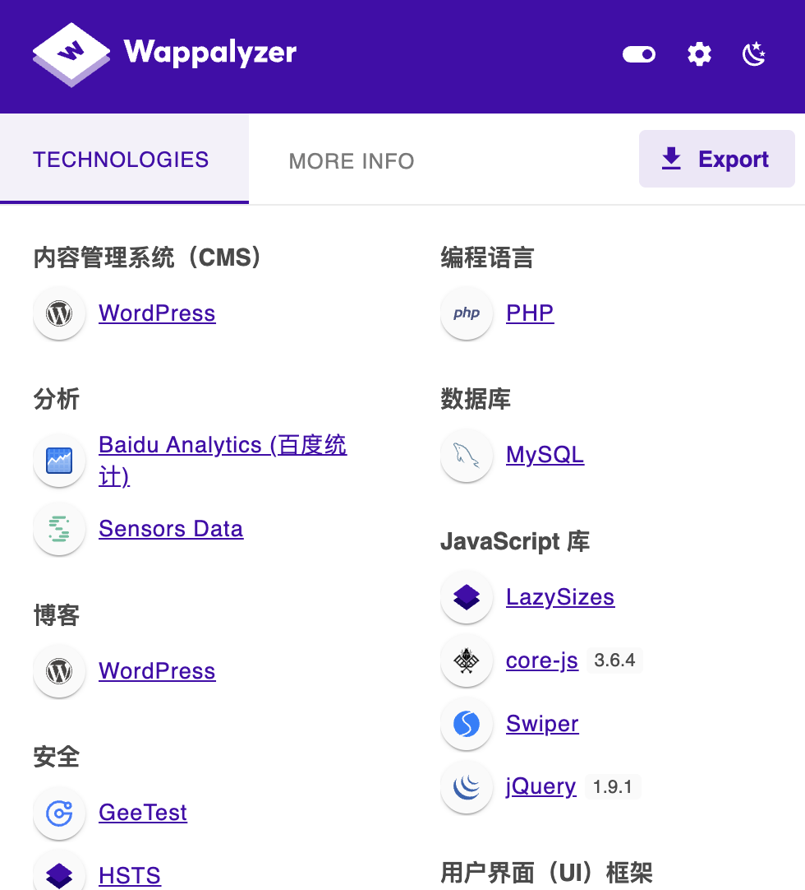

# 07.CMS指纹识别

## 1.CMS

### 1.1 什么是网站指纹？

**`Web指纹定义`**：Web指纹是一种对目标网站的识别技术，通过识别网站所使用的服务器、运行的脚本、安装的CMS等信息对目标进行精准的分类和定位。Web指纹识别可以帮助安全研究人员在安全测试中快速了解目标网站的基本信息，有助于搜索其相关漏洞。


### 1.2 CMS简介

内容管理系统（Content Management System，CMS），是一种位于WEB前端（Web 服务器）和后端办公系统或流程（内容创作、编辑）之间的软件系统。内容的创作人员、编辑人员、发布人员使用内容管理系统来提交、修改、审批、发布内容。这里指的“内容”可能包括文件、表格、图片、数据库中的数据甚至视频等一切你想要发布到Internet、Intranet以及Extranet网站的信息。

不同的CMS具有各自的命名规则和特定的文件内容。

```企业网站系统：MetInfo(米拓)、蝉知、SiteServer CMS
常见的CMS系统：
B2C商城系统：商派shopex、ecshop、hishop、xpshop
门建站系统：DedeCMS(织梦)、帝国CMS、PHPCMS、动易、cmstop
博客系统：wordpress、Z-Blog
论坛社区：discuz、phpwind、wecenter
问题系统：Tipask、whatsns
知识百科系统：HDwiki
B2B门户系统：destoon、B2Bbuilder、友邻B2B
人才招聘网站系统：骑士CMS、PHP云人才管理系统
房产网站系统：FangCms
在线教育建站系统：kesion(科汛)、EduSoho网校
电影网站系统：苹果cms、ctcms、movcms
小说文学建站系统：JIEQI CMS、linhuaming
```


### 1.3 CMS识别方法

#### 1.3.1 在线网站识别

潮汐指纹识别：
[**http://finger.tidesec.net/**](http://finger.tidesec.net/)


**WhatWeb**：
[**https://whatweb.net/**](https://whatweb.net/)

**BugScaner**：
[**http://whatweb.bugscaner.com/look**](http://whatweb.bugscaner.com/look)

#### 1.3.2 工具识别

##### 工具1--Ehole：
https://github.com/EdgeSecurityTeam/EHole
EHole是一款对资产中重点系统指纹识别的工具，在红队作战中，信息收集是必不可少的环节，如何才能从大量的资产中提取有用的系统(如OA、VPN、Weblogic…)。EHole旨在帮助红队人员在信息收集期间能够快速从C段、大量杂乱的资产中精准定位到易被攻击的系统，从而实施进一步攻击。

##### 工具2--TideFinger（潮汐指纹识别工具版）：
https://github.com/TideSec/TideFinger

##### 工具3--WhatWeb（kali集成了该工具）：
https://github.com/urbanadventurer/WhatWeb

##### 工具4--Finger：
https://github.com/EASY233/Finger
一款红队在大量的资产中存活探测与重点攻击系统指纹探测工具。

#### 1.3.3 手动识别

**1、根据HTTP响应头判断，重点关注X-Powered-By、Cookie等字段。**

**2、根据HTML特征，重点关注body、title、meta等标签的内容和属性。**

**3、根据特殊的CLASS类型判断，HTML中存在特定CLASS属性的某些DIV标签。**

#### 1.3.4 Wappalyzer插件识别
Wappalyzer是一款功能强大且非常实用的Chrome网站技术分析插件，通过该插件能够分析目标网站所采用的平台构架、网站环境、服务器配置环境、JavaScript框架、编程语言、中间件架构类型等参数，还可以检测出CMS的类型。

项目地址：https://www.wappalyzer.com/

安装：google商店安装/网盘资料自行下载




#### 1.2.4 使用指纹识别工具

指纹识别工具如**Wappalyzer**、**WhatWeb**、**CMSmap**等，专门用于自动识别网站所使用的CMS。这些工具通过扫描网站的各种特征进行分析，并根据已知CMS的指纹来判断使用的CMS类型。
