# 08.网站安全防护

## 1.WAF

### 1.1 什么是WAF？

WAF（Web应用防火墙）是一种专门用于保护Web应用免受各种网络攻击的安全防护系统。它位于Web服务器与用户之间，通过监控和过滤HTTP/HTTPS流量，防止恶意攻击进入Web应用。WAF通常可以有效防范SQL注入、跨站脚本（XSS）、跨站请求伪造（CSRF）等常见Web攻击，能够对Web应用进行深度防护，减少漏洞带来的风险。

WAF的核心功能是分析和过滤流量。它通过一系列预定义规则对进出Web应用的请求进行检查，识别潜在的恶意行为并及时阻止。与传统的防火墙不同，WAF不仅关注网络层的安全，还能检测和防御应用层的攻击。

### 1.2 WAF的分类

WAF可以根据部署方式、功能特点以及处理方式的不同进行分类。主要分类包括以下几种：

### 1.2.1.云WAF
云WAF主要利用DNS技术，通过移交域名解析权来实现安全防护，用户的请求首先发送到云端节点进行检测，如存在异常请求则进行拦截否则将请求转发至真实服务器。

常见的云WAF有阿里云盾、腾讯云 T-Sec Web 应用防火墙、百度云应用防火墙 WAF、华为云-云防火墙 CFW、华为云 Web应用防火墙 WAF、安全狗云御WEB应用防护系统、安恒玄武盾云防护、绿盟网站云防护、启明星辰虚拟化WAF、深信服云Web应用防火墙云WAF、知道创宇-创宇盾、F5 分布式云 WAF、奇安信网站卫士、360磐云、网宿Web应用防火墙、奇安信网神WEB应用安全云防护系统（安域）等

### 1.2.2.硬件WAF（常见部署模式：透明桥、透明代理、旁路镜像）
硬件WAF通常部署在Web服务器之前，过滤所有外部访问流量，并对请求包进行解析，通过安全规则库的攻击规则进行匹配，识别异常并进行请求阻断。

常见产品有绿盟Web应用防火墙、安恒明御Web应用防火墙、启明天清Web应用安全网关、长亭雷池（SafeLine） 下一代 Web 应用防火墙、远江盛邦Web应用防护系统（RayWAF）、天融信Web应用安全防护系统（TopWAF）、深信服Web应用防火墙WAF、铱迅Web应用防护系统、F5 Advanced WAF（API 安全 - 新一代 WAF）

### 1.2.3.软件WAF（常见部署模式：反向代理、嵌入式、K8S）
软件WAF安装在需要防护的服务器上，通过监听端口或以Web容器扩展方式进行请求检测和阻断。

常见产品有安全狗、云锁、D盾、网防G01、护卫神、智创、UPUPW、宝塔网站防火墙、悬镜、安骑士等

### 1.2.4.其他WAF
中间件自带的WAF模块、网站内置WAF、开源WAF（Naxsi、OpenRASP、ModSecurity）

## 1.3 WAF的监测机制

WAF的监测机制是其最核心的部分，主要通过以下几种方式对Web应用进行保护：

### 1.3.1 基于规则的监测（绿盟、启明、安恒）

WAF通常通过预定义的规则来检测和过滤恶意流量。规则可以包括常见的攻击特征（如SQL注入、XSS、文件上传漏洞等）和恶意请求模式。WAF根据这些规则实时分析进来的每一个请求，如果匹配到攻击模式，则会进行阻止或记录。这种基于规则的监测是WAF最常用的防护机制，适用于大多数已知攻击。

### 1.3.2 行为分析监测

行为分析监测是一种更为先进的WAF检测机制，通过分析用户的行为模式来识别异常活动。与基于规则的监测不同，行为分析通过识别正常用户和攻击者之间的差异，发现不符合正常行为的请求并进行处理。它能够防御未知攻击和零日漏洞攻击，适用于那些无法通过静态规则定义的攻击。

### 1.3.3  基于语义分析（长亭雷池yyds）

长亭雷池WAF的语义分析技术通过“词法→语法→语义”三层深度解码，把HTTP请求当作一段可执行“代码”来理解，先逐字符还原编码、再构建SQL/JS等抽象语法树，最终在语义层面判定是否包含恶意意图；结合AI模型持续学习正常业务表述，实现对0day、变种绕过的高精度拦截，做到无需规则库即可将误报率压至0.1%，同时通过流式处理把检测延迟控制在1 ms级。

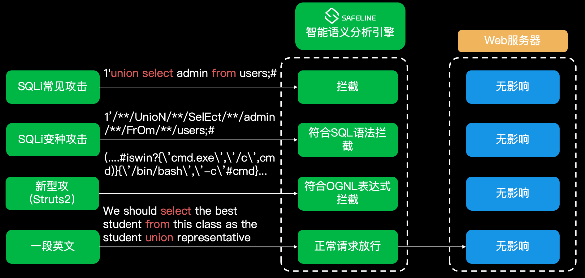

## 2.如何识别WAF

### wafw00f

- 项目地址：https://github.com/EnableSecurity/wafw00f
- nmap默认有19个指纹，sqlmap默认有94个指纹，wafw00f默认有155个指纹

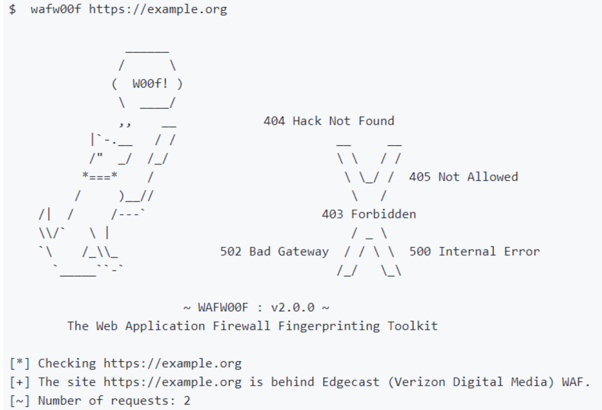

## 3.市面常见WAF告警页面

常见30多种，参考

https://mp.weixin.qq.com/s?__biz=Mzg4NTUwMzM1Ng==&mid=2247493356&idx=1&sn=6e7965695419b10dd10242a2eaf83730&scene=21&poc_token=HM3Gxmij2ysT_ZyF5UjrIa4BGeE1Eja4Yd6Gf93X

### 3.1 长亭雷池（商业版）

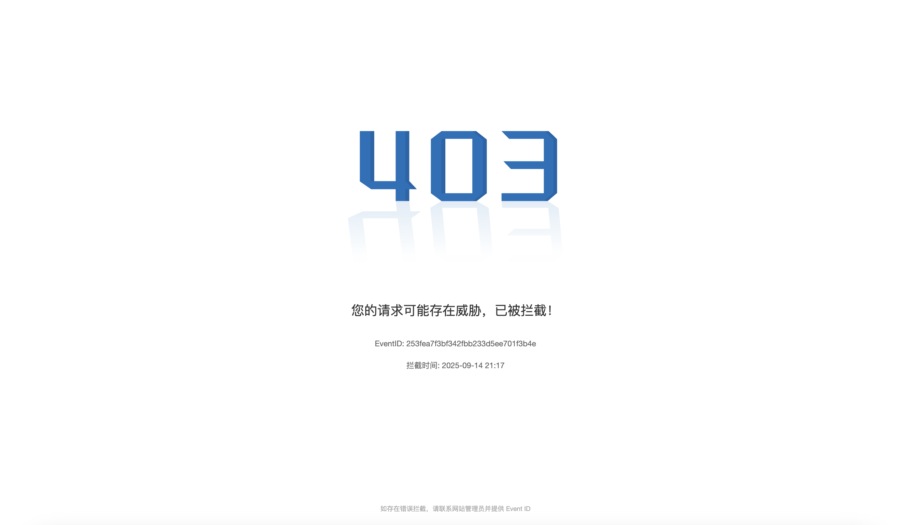

### 3.2 长亭雷池（社区版）

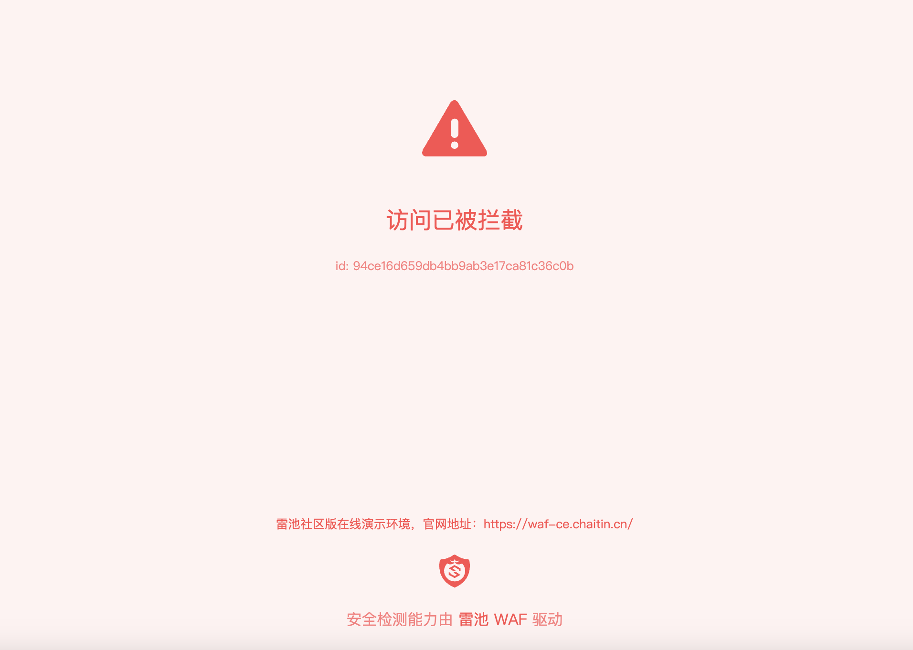

### 3.3 阿里云盾

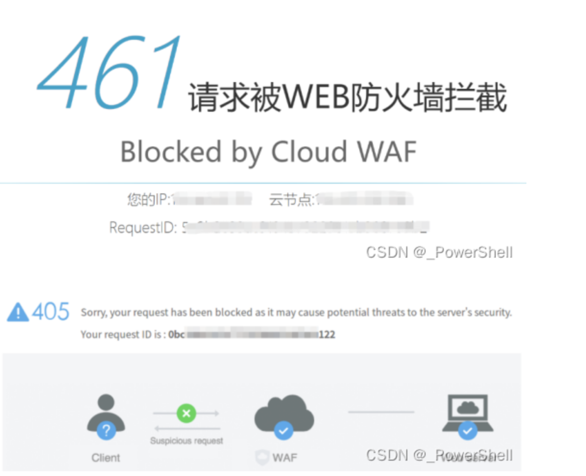

### 3.4 腾讯T-Sec Wb 应用防火墙

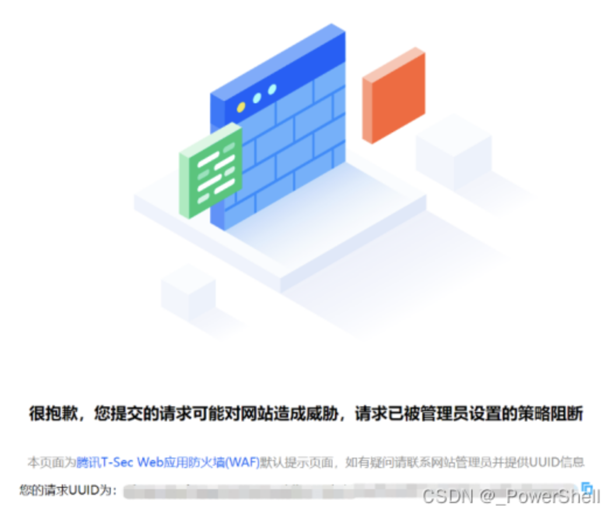

### 3.5 华为Web应用防火墙 WAF

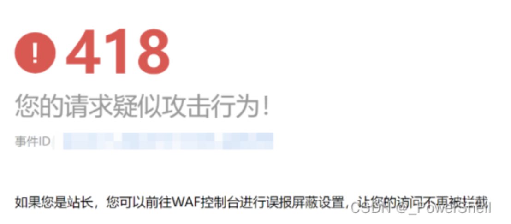

### 3.6 安恒云-Web应用防火墙（玄武盾）平台

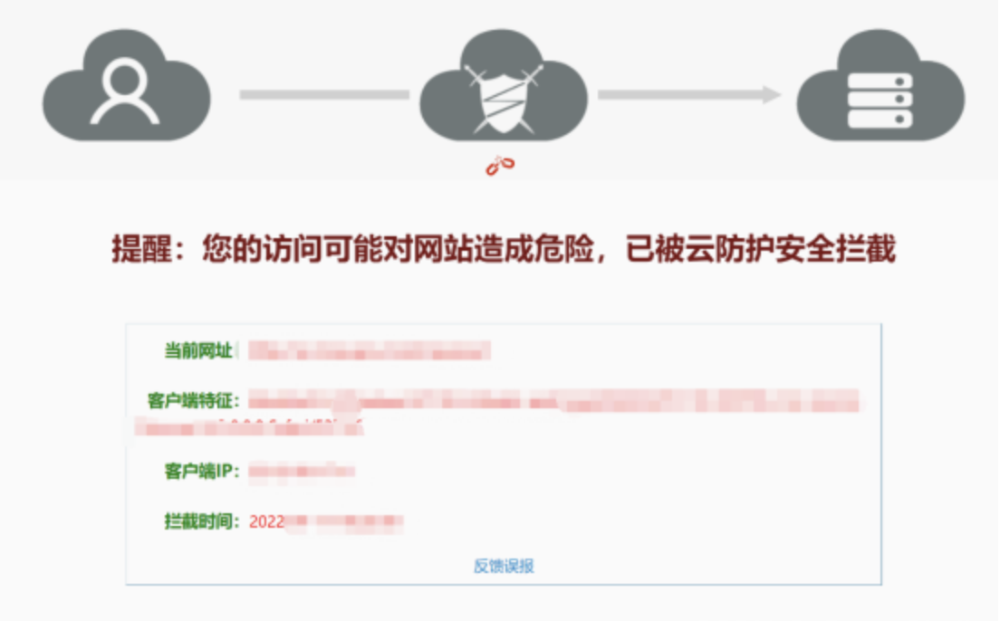

### 3.7 安全狗云御WEB应用防护系统

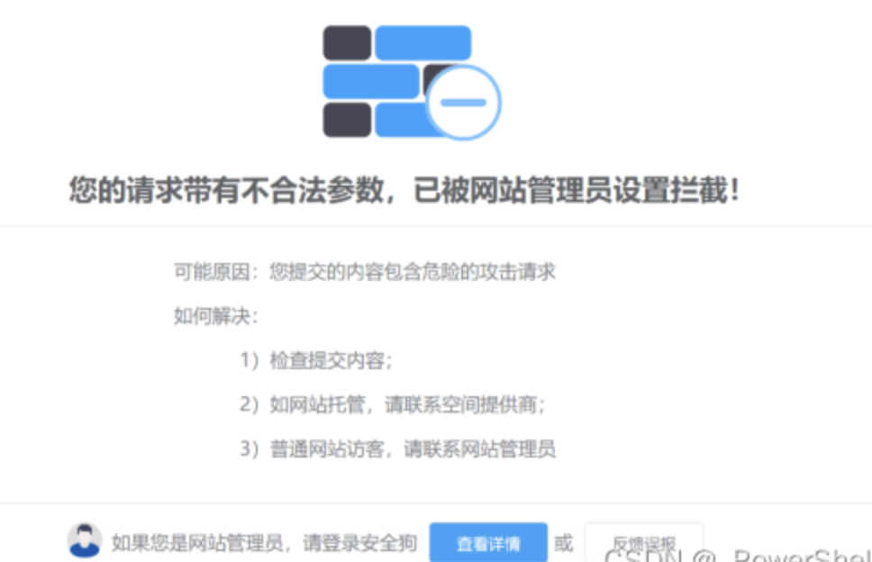

### 3.8 知道创宇-创宇盾Web应用防火墙

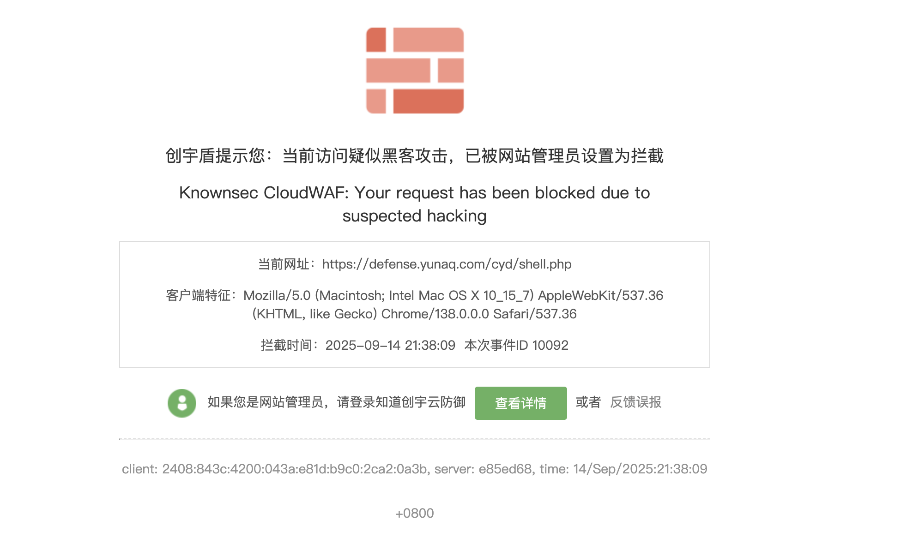

## 3.9 奇安信网神WEB应用安全云防护系统（安域）

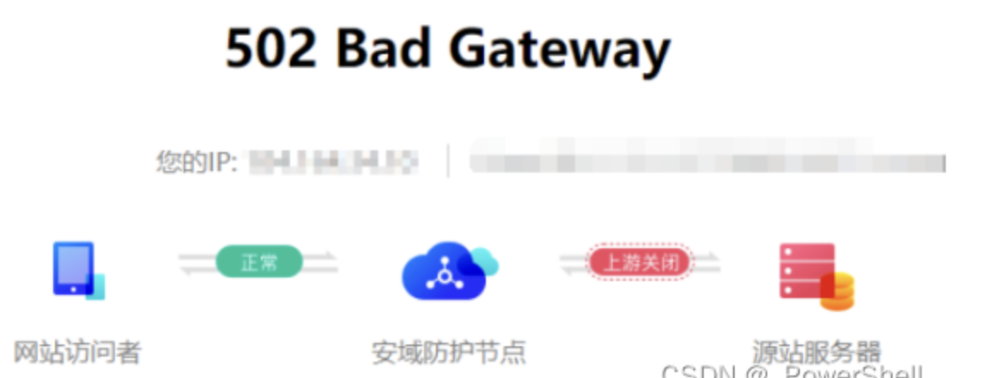

## 3.10 云锁

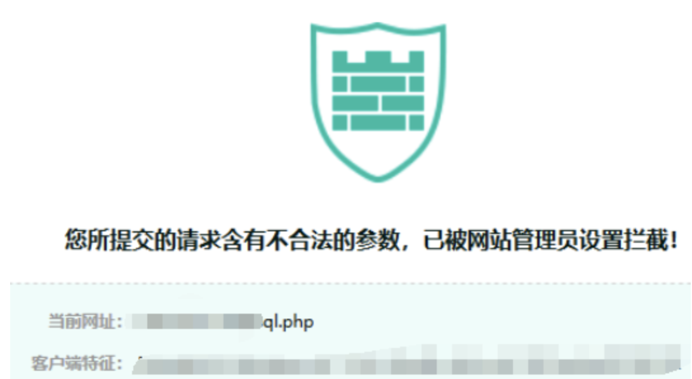

## 3.11 宝塔

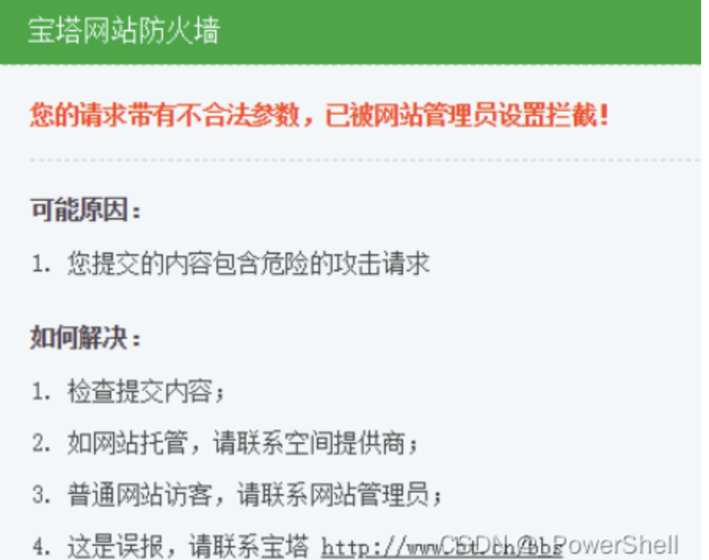
