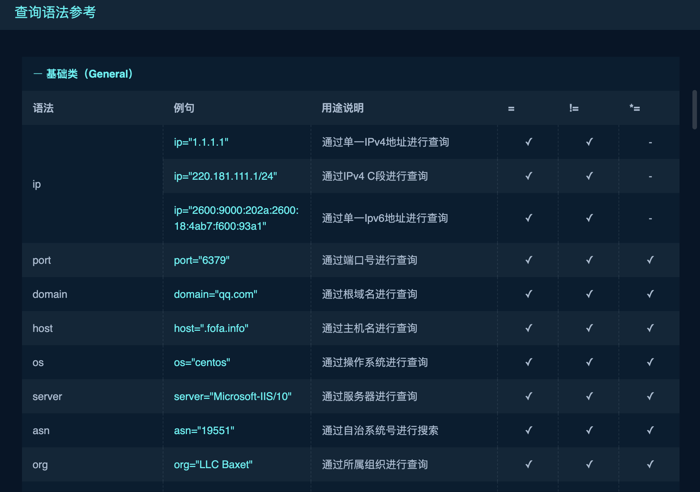

# 09.高级搜索

## 1.高级搜索语法

## 2.高级搜索引擎

### 2.1 FOFA

#### 2.1.1 什么是FOFA？

FOFA是一款网络空间测绘的搜索引擎，旨在帮助用户以搜索的方式查找**公网上的互联网资产**。简单的来说就是**网络安全中的”谷歌”**，不同的是，这些数据不仅包括像谷歌一样的网页，还包括像摄像头、打印机、数据库、操作系统等资产。

网络空间测绘可以被认为是网络空间的“地图”。就像谷歌地图或高德地图通过卫星图像对地形进行测绘，网络空间测绘也是通过技术探针对全球网络资产进行探测。但fofa是基于IP和端口去发现资产，因此有些资产是发现不了的，类似于**二级目录下的网页大概率会被收录不了**。

#### 2.1.2 fofa基础语法

基础语法在FOFA官网(https://fofa.info/)处，这里全部贴过来做个保留，可以直接跳过这个部分，等到用到的时候再查阅。

高级搜索

| 逻辑连接符 | 具体含义                                                     |
| ---------- | ------------------------------------------------------------ |
| =          | 匹配，当设置为`=""`时，可查询不存在字段或者值为空的情况。    |
| ==         | 完全匹配，当设置为`==""`时，可查询存在且值为空的情况。       |
| &&         | 与                                                           |
| ll         | 或                                                           |
| !=         | 不匹配，当设置为`!=""`时，可查询值为空的情况。               |
| *=         | 模糊匹配，使用`*`或者`?`进行搜索，比如`banner*="mys??"`(个人版及以上可用)。 |
| ()         | 确认查询优先级，括号内容优先级最高。                         |

基础类(General)

| 语法         | 例句                                                     | 描述                                                |
| ------------ | -------------------------------------------------------- | --------------------------------------------------- |
| IP           | ip=`"`1.1.1.1`"` ip=`"`220.181.111.1/24`"` ip=`"`IPv6`"` | 分别通过单一IPv4地址、IPv4C段、单一IPv6地址进行查询 |
| 端口         | port=`"`6379`"`                                          | 通过端口号进行查询                                  |
| 域名         | domain=`"`qq.com`"`                                      | 通过根域名进行查询                                  |
| 主机         | host=`"`.fofa.info`"`                                    | 通过主机名进行查询                                  |
| 操作系统     | os=`"`centos`"`                                          | 通过操作系统进行查询                                |
| 服务器       | server=`"`Microsoft-IIS/10`"`                            | 通过服务器进行查询                                  |
| 自治系统号   | asn=`"`19551`"`                                          | 通过自治系统号进行搜索                              |
| 组织         | org=`"`LLCBaxet`"`                                       | 通过所属组织进行查询                                |
| 是否拥有域名 | is_domain=true is_domain=false                           | 筛选拥有域名的资产/筛选没有域名的资产               |
| 是否为IPv6   | is_ipv6=true is_ipv6=false                               | 筛选是IPv6的资产/筛选是IPv4的资产                   |

标记类(SpecialLabel)

| 语法        | 例句                                    | 用途说明                                            |
| ----------- | --------------------------------------- | --------------------------------------------------- |
| app         | app=`"`Microsoft-Exchange`"`            | 通过FOFA整理的规则进行查询                          |
| fid         | fid=`"`sSXXGNUO2FefBTcCLIT/2Q==`"`      | 通过FOFA聚合的站点指纹进行查询                      |
| product     | product=`"`NGINX`"`                     | 通过FOFA标记的产品名进行查询                        |
| category    | category=`"`服务`"`                     | 通过FOFA标记的分类进行查询                          |
| type        | type=`"`service`"` type=`"`subdomain`"` | 筛选协议资产 筛选服务（网站类）资产                 |
| cloud_name  | cloud_name=`"`Aliyundun`"`              | 通过云服务商进行查询                                |
| is_cloud    | is_cloud=true is_cloud=false            | 筛选是云服务的资产 筛选不是云服务的资产             |
| is_fraud    | is_fraud=true is_fraud=false            | 筛选是仿冒垃圾站群的资产 筛选不是仿冒垃圾站群的资产 |
| is_honeypot | is_honeypot=true is_honeypot=false      | 筛选是蜜罐的资产 筛选不是蜜罐的资产                 |

协议类(type=service)

| 语法          | 例句                                            | 用途说明                                            |
| ------------- | ----------------------------------------------- | --------------------------------------------------- |
| protocol      | protocol=`"`quic`"`                             | 通过协议名称进行查询                                |
| banner        | banner=`"`users`"`                              | 通过协议返回信息进行查询                            |
| base_protocol | base_protocol=`"`udp`"` base_protocol=`"`tcp`"` | 查询传输层为udp协议的资产 查询传输层为tcp协议的资产 |

网站类(type=subdomain)

| 语法         | 例句                                             | 用途说明                                     |
| ------------ | ------------------------------------------------ | -------------------------------------------- |
| title        | title=`"`beijing`"`                              | 通过网站标题进行查询                         |
| header       | header=`"`elastic`"`                             | 通过响应标头进行查询                         |
| header_hash  | header_hash=`"`1258854265`"`                     | 通过http/https响应头计算的hash值进行查询     |
| body         | body=`"`网络空间测绘`"`                          | 通过HTML正文进行查询                         |
| body_hash    | body_hash=`"`-2090962452`"`                      | 通过HTML正文计算的hash值进行查询             |
| js_name      | js_name=`"`js/jquery.js`"`                       | 通过HTML正文包含的JS进行查询                 |
| js_md5       | js_md5=`"`82ac3f14327a8b7ba49baa208d4eaa15`"`    | 通过JS源码进行查询                           |
| cname        | cname=`"`ap21.inst.siteforce.com`"`              | 通过别名记录进行查询                         |
| cname_domain | cname_domain=`"`siteforce.com`"`                 | 通过别名记录解析的主域名进行查询             |
| icon_hash    | icon_hash=`"`-247388890`"`                       | 通过网站图标的hash值进行查询                 |
| status_code  | status_code=`"`402`"`                            | 筛选服务状态为402的服务（网站）资产          |
| icp          | icp=`"`京ICP证030173号`"`                        | 通过HTML正文包含的ICP备案号进行查询          |
| sdk_hash     | sdk_hash==`"`Mkb4Ms4R96glv/T6TRzwPWh3UDatBqeF`"` | 通过网站嵌入的第三方代码计算的hash值进行查询 |

地理位置(Location)

| 语法    | 例句                                    | 用途说明                                  |
| ------- | --------------------------------------- | ----------------------------------------- |
| country | country=`"`CN`"` country=`"`中国`"`     | 通过国家的简称代码或中文名称进行查询      |
| region  | region=`"`Zhejiang`"` region=`"`浙江`"` | 通过省份/地区的英文名称或中文名称进行查询 |
| city    | city=`"`Hangzhou`"`                     | 通过城市英文名称进行查询                  |

证书类

| 语法             | 例句                                            | 用途说明                         |
| ---------------- | ----------------------------------------------- | -------------------------------- |
| cert             | cert=`"`baidu`"`                                | 通过证书进行查询                 |
| cert.subject     | cert.subject=`"`OracleCorporation`"`            | 通过证书的持有者进行查询         |
| cert.issuer      | cert.issuer=`"`DigiCert`"`                      | 通过证书的颁发者进行查询         |
| cert.subject.org | cert.subject.org=`"`OracleCorporation`"`        | 通过证书持有者的组织进行查询     |
| cert.subject.cn  | cert.subject.cn=`"`baidu.com`"`                 | 通过证书持有者的通用名称进行查询 |
| cert.issuer.org  | cert.issuer.org=`"`cPanel,Inc.`"`               | 通过证书颁发者的组织进行查询     |
| cert.issuer.cn   | cert.issuer.cn=`"`SynologyInc.CA`"`             | 通过证书颁发者的通用名称进行查询 |
| cert.is_valid    | cert.is_valid=true cert.is_valid=false          | 筛选证书有效性的资产             |
| cert.is_match    | cert.is_match=true cert.is_match=false          | 筛选证书和域名匹配性的资产       |
| cert.is_expired  | cert.is_expired=true cert.is_expired=false      | 筛选证书过期状态的资产           |
| jarm             | jarm=`"`15af977ce25de452b96affa2addb1036`"`     | 通过JARM指纹进行查询             |
| tls.version      | tls.version=`"`TLS1.3`"`                        | 通过tls的协议版本进行查询        |
| tls.ja3s         | tls.ja3s=`"`15af977ce25de452b96affa2addb1036`"` | 通过tls的ja3s指纹进行查询        |

时间类(Lastupdatetime)

| 语法         | 例句                                            | 用途说明                     |
| ------------ | ----------------------------------------------- | ---------------------------- |
| after        | after=`"`2023-01-01`"`                          | 筛选某一时间之后有更新的资产 |
| before       | before=`"`2023-12-01`"`                         | 筛选某一时间之前有更新的资产 |
| after&before | after=`"`2023-01-01`"`&&before=`"`2023-12-01`"` | 筛选某一时间区间有更新的资产 |

独立IP语法

独立IP系列语法，不可和上面其他语法共用

| 语法         | 例句                       | 用途说明                            |
| ------------ | -------------------------- | ----------------------------------- |
| port_size    | port_size=`"`6`"`          | 筛选开放端口数量等于6个的独立IP     |
| port_size_gt | port_size_gt=`"`6`"`       | 筛选开放端口数量大于6个的独立IP     |
| port_size_lt | port_size_lt=`"`12`"`      | 筛选开放端口数量小于12个的独立IP    |
| ip_ports     | ip_ports=`"`80,161`"`      | 筛选同时开放不同端口的独立IP        |
| ip_country   | ip_country=`"`CN`"`        | 通过国家的简称代码进行查询独立IP    |
| ip_region    | ip_region=`"`Zhejiang`"`   | 通过省份/地区英文名称进行查询独立IP |
| ip_city      | ip_city=`"`Hangzhou`"`     | 通过城市英文名称进行查询独立IP      |
| ip_after     | ip_after=`"`2021-03-18`"`  | 筛选某一时间之后有更新的独立IP      |
| ip_before    | ip_before=`"`2019-09-09`"` | 筛选某一时间之前有更新的独立IP      |

#### 2.1.3 fofa的奇淫巧技

##### 1.批量发现资产

在平时的漏洞挖掘中，若发现漏洞，都可以尝试通过FOFA搜索，因为这个模板很有可能是一些通用的建站模板，通过F12查看网页特征，直接FOFA搜索网页特征`body="为全体师生提供咨询、生活....综合服务"`，这个地方要根据实际的情况选择语法进行搜索，比如搜索特别的js名称，`favicon.ico`等，可使用fofa批量发现相关资产

##### 2.发现脆弱资产

挖掘特定目标的漏洞，可通过fofa目标网站的`favicon`图标，例如:`icon_hash="1471194169"`，可检索到大量隐藏资产。

##### 3.其他操作

除了上述这些操作，还可以利用fofa：

- 找DVWA靶场：`title="DVWA"`
- SQLi-LABS靶场:`title="SQL Injections"`
- 看看黑客们都用啥工具：`body="Directory listing for /" && body="dirsearch"`,这里工具可以替换为BurpSuite等
- 阿里云key：`body="AccessKeyId" && body="AccessKeySecret" && body="Expiration"`

### 2.2 hunter